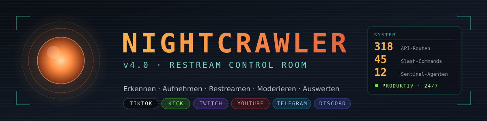
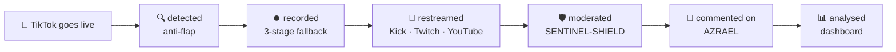
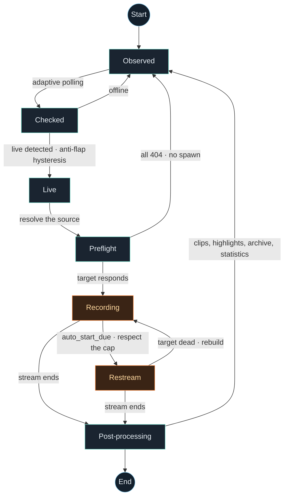
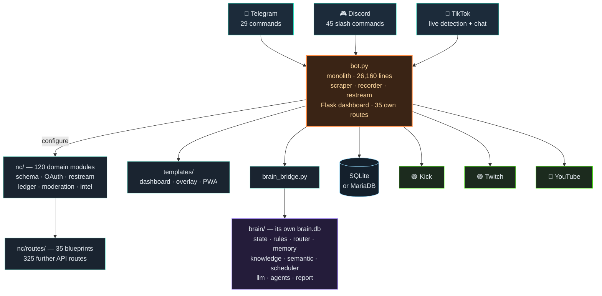
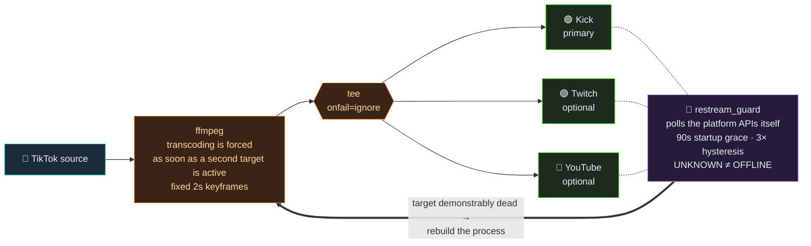

<div align="center">



### The control room for live streaming
#### Monitoring · Recording · Multi-target restream · AI moderation

🌐 **English** · [Deutsch](README.md)

[](https://lafap.de)

[](LICENSE)
[](https://www.python.org/)
[](#-installation)
[](#-project-status)
[](../../actions/workflows/ci.yml)

[](#️-operating-it)
[](#️-operating-it)
[](#-what-nightcrawler-does)
[](#-restream)
[](#-restream)
[](#-restream)
[](docs/CHANGELOG.md)

[](https://lafap.de)
[](https://discord.gg/psvnxm7tSV)

<br>

> **A TikTok stream goes live → it is detected, recorded, forwarded to
> Kick/Twitch/YouTube, moderated and commented on in all three chats — fully
> automatic, on a single server, without a cloud subscription.**

</div>



---

## 📋 Table of contents

<table>
<tr><td>

- [✨ What NIGHTCRAWLER does](#-what-nightcrawler-does)
- [🏗️ Architecture](#️-architecture)
- [⚡ Quick start](#-quick-start)
- [📦 Installation](#-installation)
- [⚙️ Configuration](#️-configuration)
- [🕹️ Operating it](#️-operating-it)

</td><td>

- [📡 Restream](#-restream)
- [🧠 The brain (AZRAEL)](#-the-brain-azrael)
- [🖥️ Dashboard](#️-dashboard)
- [🚀 Deployment](#-deployment)
- [🧪 Tests & verification chain](#-tests--verification-chain)
- [🛡️ Security](#️-security)

</td><td>

- [🗺️ Project layout](#️-project-layout)
- [🩺 Troubleshooting](#-troubleshooting)
- [📈 Project status](#-project-status)
- [🧭 Roadmap](#-roadmap)
- [🤝 Contributing](#-contributing)
- [📄 Licence](#-licence)

</td></tr>
</table>

---

## ✨ What NIGHTCRAWLER does

<table>
<tr>
<td width="33%" valign="top">

### 🔍 Detect
Adaptive polling of tracked TikTok channels with **anti-flap hysteresis** — no
false alarm on short dropouts. Subscriber streams are detected and reported
separately.

</td>
<td width="33%" valign="top">

### ⏺️ Record
**Three-stage recorder fallback**: native (ffmpeg) → streamlink → yt-dlp. A
preflight check before every spawn, so no ffmpeg spends minutes running against
a 404.

</td>
<td width="33%" valign="top">

### 📡 Forward
Multi-target **restream** to Kick, Twitch and YouTube simultaneously — with
`tee` fan-out, automatic transcoding and target verification against the
platform APIs.

</td>
</tr>
<tr>
<td valign="top">

### 🛡️ Moderate
**SENTINEL-SHIELD**: deterministic anti-doxxing and hate detection with
leetspeak, homoglyph and zero-width normalisation. Runs **before** any AI and
costs no budget.

</td>
<td valign="top">

### 🤖 Join in
**AZRAEL**, the AI co-host, answers in the Kick, Twitch and YouTube chats,
reacts live to the outgoing stream and overlays itself on the broadcast.

</td>
<td valign="top">

### 📊 Analyse
Flask dashboard with **360 API routes**, knowledge-graph visualisation, a
revenue journal (tax-office ready, append-only with a hash chain) and a PWA for
your phone.

</td>
</tr>
</table>

<details>
<summary><b>🔎 Expand the full feature list</b></summary>

<br>

| Area | Function |
|---|---|
| **Live detection** | Adaptive polling · anti-flap hysteresis · subscriber-stream detection · proxy/SOCKS support · cookie rotation |
| **Recording** | Three-stage recorder fallback · preflight GET before spawn · suffix fallback for CDN quirks · recording watchdog against frozen captures · S3 backup (optional) |
| **Restream** | Kick / Twitch / YouTube in parallel · `tee` with `onfail=ignore` · forced transcode with multiple targets · target verification through the platform APIs · resume after restart · safe test push without broadcast risk · cap on concurrent restreams |
| **Chat & moderation** | SENTINEL-SHIELD (doxxing / hate / threats) · shared moderation heuristic across Kick, Twitch, YouTube · foreign-advertising detection with an own-channel allowlist · banned words · timeout escalation |
| **AI (AZRAEL)** | Chat answers when addressed · live reactions to the broadcast · speech output (Piper) · persona system · multi-backend: llama.cpp → Ollama → free APIs → OpenAI/Anthropic · budget and tier control |
| **Brain (`brain/`)** | State machine · rule-based tier-1 decisions with a why-log · long-term memory · knowledge graph (triple store) · semantic search · forecasts · weekly report |
| **Sentinel fleet** | 13 watchdog agents (health, recovery, scout, analytics, learning, sentinel, disk, swap, restream, toxicity, uptime, recording, proxy) with Telegram alarms, individually switchable |
| **Community** | Recognition of regular viewers · loyalty points & ranks · Discord XP, levels, daily streak · live ping · highlight share · community events |
| **Money** | Donation telemetry (estimates) · separate revenue journal (`nc/ledger.py`) with a hash chain and CSV export for the tax office |
| **Dashboard** | 360 Flask routes · live panels · brain visualisation with a learning curve · overlay for OBS · installable PWA (Android) · QR login |
| **Operations** | systemd service · deploy script with pre-check and auto-rollback · self-test route · dead-man's report on process death · CrowdSec integration · log redaction for cookies and stream keys |
| **Multilingual** | German and English, switchable in the dashboard · `UI_LANG` for the bot · browser language detection · translation catalogue in `locales/` |
| **Database** | SQLite **or** MariaDB · central schema module · export tool · SQL guard |

</details>

### The life cycle of a stream



---

## 🏗️ Architecture



> [!IMPORTANT]
> **The architectural boundary that holds:** `nc/*` and `brain/*` **never**
> import from `bot.py`. Configuration comes exclusively through
> `configure(...)` injection. That keeps both libraries testable in isolation
> and prevents circular imports. `brain/` is thread-based and stdlib-only.

---

## ⚡ Quick start

```bash
git clone https://github.com/itsamemedev/Telegram-Stream-Info-Bot.git
cd Telegram-Stream-Info-Bot

python3 -m venv .venv && source .venv/bin/activate
pip install -r requirements.txt
sudo apt install -y ffmpeg streamlink yt-dlp

cp .env.example .env && nano .env      # at least set BOT_TOKEN
python3 bot.py
```

The dashboard is then at <http://127.0.0.1:8050> — from outside only through an
SSH tunnel, see [Security](#️-security).

Want the interface in English? Set `UI_LANG=en` in the `.env`, or switch it in
the dashboard's top bar — the choice is stored per browser.

---

## 📦 Installation

### Fast route — guided installer

If you do not want to walk every step yourself: the scripts set everything up,
**explain each step as they go** and ask before every intervention. Optional
building blocks (Discord, restream targets, transcription, MariaDB, CrowdSec,
local LLM) are offered individually; where a password can be chosen freely they
offer to generate one.

```bash
# Ubuntu · Debian · Raspberry Pi OS · macOS
git clone https://github.com/itsamemedev/Telegram-Stream-Info-Bot.git ~/nightcrawler
bash ~/nightcrawler/tools/installer.sh          # --express = fewer questions, --unattended = none
```

```bat
rem Windows
tools\install.bat
```

Both create the venv and the `.env`, install the system packages, verify with
`bot.py --selfcheck` and, on request, set up autostart — on Linux systemd
including the dead-man's report and the status MOTD (`tools/motd.sh`), on macOS
launchd, on Windows the task scheduler. A second run updates an existing
installation instead of steamrolling it.

### Requirements

| | Minimum | Recommended |
|---|---|---|
| **Operating system** | Linux with systemd | Ubuntu 22.04 / 24.04 LTS |
| **Python** | 3.12 | 3.13 |
| **CPU** | 4 cores | 8 cores (transcoding without a GPU) |
| **RAM** | 4 GB | 16 GB (with a local LLM) |
| **Disk** | 20 GB | 200 GB+ (recordings) |
| **Network** | 10 Mbit upload | 50 Mbit+ (multi-restream) |

> [!IMPORTANT]
> **Python 3.12 is a hard minimum.** `bot.py` uses f-strings containing
> backslashes (PEP 701) — on 3.11 even parsing the file fails. Debian 12 and
> Raspberry Pi OS bookworm ship 3.11; the installer detects that and offers a
> route to a newer interpreter.

### By hand

System packages, venv, `.env`, database, first start, local LLM and the OAuth
flows — step by step in **[`docs/en/INSTALL.md`](docs/en/INSTALL.md)**.

---

## ⚙️ Configuration

Every setting lives in the `.env`. The template `.env.example` knows **around
500 variables** — the minimum is small:

### 🔑 Mandatory

```ini
BOT_TOKEN=123456:ABC-DEF…            # Telegram bot from @BotFather
ADMIN_CHAT_ID=123456789              # your Telegram ID (alarms, admin commands)
```

### 🎛️ Frequently set

<table>
<tr><th>Area</th><th>Variables</th></tr>
<tr><td><b>Discord</b></td><td><code>DISCORD_TOKEN</code>, <code>DISCORD_GUILD_ID</code>, <code>DISCORD_ADMIN_ROLE</code></td></tr>
<tr><td><b>Restream</b></td><td><code>KICK_STREAM_KEY</code>, <code>TWITCH_ENABLED</code>, <code>TWITCH_STREAM_KEY</code>, <code>YOUTUBE_ENABLED</code>, <code>YOUTUBE_STREAM_KEY</code>, <code>RESTREAM_SINGLE</code>, <code>RESTREAM_MAX_CONCURRENT</code>, <code>RESTREAM_BITRATE_K</code>, <code>RESTREAM_FPS</code></td></tr>
<tr><td><b>AI</b></td><td><code>AI_PROVIDER</code>, <code>REACTION_AI_PROVIDER</code>, <code>BRAIN_LLM_TIMEOUT_S</code>, <code>BRAIN_LLM_MAX_TOKENS</code>, <code>OPENAI_API_KEY</code>, <code>ANTHROPIC_API_KEY</code>, <code>POLLINATIONS_API_KEY</code></td></tr>
<tr><td><b>Moderation</b></td><td><code>SENTINEL_SHIELD</code>, <code>MOD_BLOCK_ADS</code>, <code>AZRAEL_CHAT_REPLY</code>, <code>AZRAEL_REACT_ONLY_LIVE</code></td></tr>
<tr><td><b>Dashboard</b></td><td><code>DASHBOARD_HOST</code>, <code>DASHBOARD_PORT</code>, <code>DASHBOARD_TOKEN</code></td></tr>
<tr><td><b>Language</b></td><td><code>UI_LANG</code> — <code>de</code> (default) or <code>en</code>; per visitor the dashboard switch and the browser's Accept-Language override it</td></tr>
<tr><td><b>Database</b></td><td><code>DB_BACKEND</code>, <code>DB_HOST</code>, <code>DB_NAME</code>, <code>DB_USER</code>, <code>DB_PASS</code></td></tr>
</table>

### 🔐 Setting up OAuth

| Platform | Guide |
|---|---|
| Twitch | **[`docs/en/SETUP_TWITCH_OAUTH.md`](docs/en/SETUP_TWITCH_OAUTH.md)** |
| YouTube | **[`docs/en/SETUP_YT_OAUTH.md`](docs/en/SETUP_YT_OAUTH.md)** |
| Kick | user OAuth directly in the dashboard panel (set title & category) |

> [!WARNING]
> **The `.env` never belongs in the repository.** It contains cookies, OAuth
> tokens and stream keys. `.gitignore` already blocks it — a secret that has
> been committed once is still in the history after you delete it.

---

## 🕹️ Operating it

### Telegram

| Command | Effect |
|---|---|
| `/start` · `/about` | Getting started, bot info |
| `/track <user>` · `/track_exact <user>` | Add a streamer to tracking |
| `/untrack <user>` · `/tracklist` | Remove / overview |
| `/live` · `/tiktok` | Who is live right now |
| `/bulkadd` | Track many streamers at once |
| `/recstatus` · `/stoprec` · `/cleanup` | Recordings: status, stop, clean up |
| `/stats` · `/topusers` · `/summary` | Analyses |
| `/ai <question>` · `/aireset` | Ask AZRAEL / reset the history |
| `/brain` · `/brain teste` · `/report` | Brain status, self-test, weekly report |
| `/diag` · `/sysres` · `/quota` · `/logs` | Diagnostics, resources, quotas, logs |
| `/pause` · `/resume` | Pause / resume tracking |
| `/update` | Self-update from the repository |
| `/cookies` · `/teststream` | Cookie state, test stream |
| `/einnahmen` | Revenue journal (booking, yearly overview) |

<details>
<summary><h3>Discord — 45 slash commands</h3></summary>

<br>

**Stream & bot**
`/status` · `/track` · `/untrack` · `/tracklist` · `/livenow` · `/recstatus` ·
`/restream_status` · `/stats` · `/streaminfo` · `/topstreamers` · `/botstats` ·
`/post_test` · `/sys_report` · `/sys_unpause`

**AI**
`/ai` · `/ask`

**Community & gamification**
`/rank` · `/profile` · `/leaderboard` · `/daily` · `/follow` · `/unfollow` ·
`/event` · `/events` · `/help`

**Clips**
`/clip` · `/clips` · `/clipoftheweek`

**Moderation** *(admin role required)*
`/ban` · `/kick` · `/timeout` · `/warn` · `/warnings` · `/clearwarns` · `/purge`

**Server setup** *(admin role required)*
`/setup_community` · `/setup_targets` · `/create_channel` · `/create_voice` ·
`/create_category` · `/create_role` · `/create_group` · `/assign_role` ·
`/remove_role` · `/set_channel_perms`

> The `/sys_*` commands execute the **original Telegram handlers** through an
> update/context shim — zero duplicates, so Telegram fixes automatically apply
> in Discord too.

</details>

---

## 📡 Restream



**Arming it** — in the `.env`:

```ini
KICK_STREAM_KEY=…
TWITCH_ENABLED=1
TWITCH_STREAM_KEY=…
YOUTUBE_ENABLED=1
YOUTUBE_STREAM_KEY=…
RESTREAM_MAX_CONCURRENT=2
```

<details>
<summary><b>Why multi-target does not work without transcoding</b></summary>

<br>

In copy mode the `tee` hands the same H.264 bitstream to every target — but
Kick, Twitch and YouTube have different keyframe/GOP requirements. At least one
target then rejects the stream or stutters. That is why NIGHTCRAWLER forces
transcoding as soon as a second target is active, producing a
platform-conformant GOP that all three accept at once.

The cost: transcoding needs CPU. On a server without a GPU, lower
`RESTREAM_BITRATE_K` / `RESTREAM_FPS` if you must.

</details>

<details>
<summary><b>Why “online” does not mean “the process is running”</b></summary>

<br>

Twitch and YouTube carry `onfail=ignore` in the `tee` muxer — so that a stuck
Twitch does not drag Kick down with it. That is exactly why ffmpeg keeps running
when they drop out: the panel showed three green targets while nothing arrived
on two platforms.

`_restream_verify_loop` therefore polls **the platforms themselves**
periodically (Kick keyless, Twitch Helix, YouTube Data API) and rebuilds the
restream when a target is demonstrably dead. Four rules in
`nc/restream_guard.py` prevent restart loops:

1. **90 s startup grace** — RTMP can take up to a minute to report “live”.
2. **Hysteresis** — three consecutive negatives, not one.
3. **UNKNOWN ≠ OFFLINE** — an API timeout is no proof of a dead stream.
4. **Cap** — `RESTREAM_MAX_CONCURRENT` limits parallel encodes.

</details>

<details>
<summary><b>Test push: check a target without broadcast risk</b></summary>

<br>

`nc/restream_testpush.py` sends a short synthetic push to a configured target
and reports whether the ingest accepts it — before you go live and a viewer
notices instead.

</details>

---

## 🧠 The brain (AZRAEL)

`brain/` is a self-contained, bot-free AI core with its own database. **If the
directory is missing the bot starts exactly as it does without it** — every
building block is additive, fail-open and individually switchable.

| Module | Job |
|---|---|
| `state.py` | State machine — system mirror, transitions |
| `rules.py` | Rule engine (tier 1) — LLM-free, with a why-log |
| `router.py` | Task router: `rules → db → knowledge → llm` |
| `memory.py` | Long-term memory (sessions, metrics) |
| `knowledge.py` | Knowledge graph (triple store, explainable) |
| `semantic.py` | Semantic search |
| `scheduler.py` | Forecasts and poll hints |
| `llm.py` | LLM runtime: llama.cpp → Ollama → fallback |
| `agents.py` | Sentinel fleet (13 watchdogs, individually switchable) |
| `report.py` | Weekly report in Markdown |

### 🛰️ The sentinel fleet

| Agent | Watches over |
|---|---|
| `health` | Overall state, health score |
| `recovery` | Self-healing: restarts, gates |
| `scout` | New sources and opportunities |
| `analytics` | Metrics and trends |
| `learning` | Learning progress of the knowledge graph |
| `sentinel` | CrowdSec — attack spikes, blind defence |
| `disk` | Free space + an estimate of “hours until full” |
| `swap` | Swap usage — clears it itself when RAM allows (`SWAP_CLEAR_CMD`) |
| `restream_sentinel` | **Silently** failing restream targets, shared keys |
| `toxicity` | A **wave** of chat toxicity (a possible raid) |
| `uptime` | Chat connections per platform, reconnect flapping |
| `recording` | Recordings with a live PID but a file that is not growing |
| `proxy` | Success and 403 rate of the TikTok fetches (server IP / proxy block) |

Every agent is isolated — a dead agent can never kill the tick. Switch one off
with `BRAIN_AGENT_<NAME>=0`.

### 🛡️ SENTINEL-SHIELD

Deterministic detection **before** banned words and **before** any AI:

- **Anti-doxxing** — phone numbers, IBANs, home addresses, coordinates, e-mail, real-name callouts
- **Anti-hate/threat** — incitement including code numbers (with a purchase-context guard), calls to suicide, threats of violence
- **De-obfuscation** — leetspeak, Unicode homoglyphs (`ѕіеg` → `sieg`), zero-width characters, diacritics (NFKD), separators (`h-e-i-l`)

> [!NOTE]
> The shield is deliberately tuned to **zero false positives**: `Sieglinde`,
> `1488 euro`, `heiliger`, `e-mail` and genuine Cyrillic stay untouched. In
> moderation, a viewer punished unjustly is worse than a troll slipping
> through. Switch it off with `SENTINEL_SHIELD=0`.

---

## 🖥️ Dashboard

A Flask dashboard with **360 routes** on `127.0.0.1:8050`.

```bash
# From your laptop — never open the port:
ssh -L 3000:localhost:8050 ubuntu@<server-ip>
# Then in the browser:  http://localhost:3000
```

| Page | Content |
|---|---|
| `/` | Main control room: live, recordings, restream, community, money, defence |
| `/brain` | Brain: knowledge graph, learning curve, sentinel fleet, agent log |
| `/overlay` | OBS overlay: AZRAEL speech bubble, donation box, title |
| `/api/selftest` | **“What is broken right now?”** — every finding with the command that fixes it |

The language switcher sits in the top bar next to the theme toggle. The choice
is stored in a cookie and survives a browser restart; without a choice the
browser's `Accept-Language` decides, and `UI_LANG` is the fallback.

### 📸 Screenshots

> [!NOTE]
> Screenshots to follow. The dashboard shows live operational data — the images
> have to be cleared of stream keys, tokens and viewer names before
> publication. The instructions for that sit as a comment in the source of this
> section in [`README.md`](README.md).

### 📱 As an app on your phone (PWA)

The dashboard is a **progressive web app** — open Chrome → menu → “Add to home
screen”. It then starts full-screen with its own icon, without the Play Store
and without an APK. It needs HTTPS, so use your domain rather than the local IP.

> [!IMPORTANT]
> The service worker **never** caches `/api/` responses. This is a live control
> panel — cached API data would show a stale bot state (“live” while offline).
> Only the static shell is cached.

---

## 🚀 Deployment

### systemd service

```ini
# /etc/systemd/system/nightcrawler.service
[Unit]
Description=NIGHTCRAWLER
After=network-online.target

[Service]
Type=simple
User=ubuntu
WorkingDirectory=/home/ubuntu/nightcrawler
ExecStart=/home/ubuntu/nightcrawler/.venv/bin/python3 bot.py
Restart=always
RestartSec=10

[Install]
WantedBy=multi-user.target
```

```bash
sudo systemctl daemon-reload
sudo systemctl enable --now nightcrawler
journalctl -u nightcrawler -f          # Ctrl+C only ends the tailing
```

### Safe rollout — `tools/deploy.sh`

```bash
bash tools/deploy.sh <build.zip>
```

The script first unpacks the new build into a **side directory** and checks it
there completely — `py_compile`, `pyflakes`, `ruff`, all test runs,
`ncpatch check`, `node --check` on the dashboard scripts. The running bot is
**not touched** while this happens.

Only when everything is green does it stop, switch over and start. Afterwards it
verifies for itself: is the service running, does the dashboard answer, what
does the self-test say. If anything goes wrong it **restores the backup
automatically**. If the pre-check fails, nothing happens at all.

```bash
BOT_DIR=~/my-bot SERVICE=mybot bash tools/deploy.sh <build.zip>
```

### Dead-man's report *(strongly recommended)*

If the process dies completely, **nobody else** will tell you:

```bash
chmod +x tools/notify_failure.sh
sudo systemctl edit nightcrawler     # → [Unit] OnFailure=nightcrawler-notify@%n.service
```

After that every outage produces a Telegram/Discord message with the last log
lines.

In detail: **[`docs/en/DEPLOY.md`](docs/en/DEPLOY.md)** and
**[`docs/START_HIER.txt`](docs/START_HIER.txt)** (German).

---

## 🧪 Tests & verification chain

> [!CAUTION]
> **This chain runs before every release — in full, not in part.**

```bash
python3 -m py_compile <changed .py>
python3 -m pyflakes   <changed .py>                        # 0 findings
python3 -m ruff check --select F,E9,B --ignore B905 <changed .py>
python3 tools/ncpatch.py check                             # check templates
python3 tools/ncpatch.py docs                              # numbers in the docs
python3 tools/i18n_extract.py --check en                   # translation catalogue
python3 test_smoke.py
python3 test_nc_modules.py
python3 test_restream.py
```

| Test | Covers |
|---|---|
| `test_smoke.py` | **Actually** executes `bot.py` — NameError, ordering traps, a 500 on first call. Needs `pip install -r requirements-smoke.txt` (5 packages); runs in CI since v4.1-W31. |
| `test_nc_modules.py` | The domain modules in `nc/` in isolation, without network and without a database |
| `test_restream.py` | Static contracts against the restream path |
| `test_m2_bridge.py` | Adapter bot ↔ `brain/` |
| `brain/test_m*.py` | The brain modules individually |
| `nc/intel/test_intel.py` | Archive index, transcripts, reels |

The module tests in `brain/` and `nc/intel/` need the project root on the search
path:

```bash
PYTHONPATH=. python3 brain/test_m1.py
PYTHONPATH=. python3 nc/intel/test_intel.py
```

Whatever can be checked without the full runtime stack runs automatically on
every push: **[`.github/workflows/ci.yml`](.github/workflows/ci.yml)** — lint,
templates, documentation numbers, contracts and a secret scan on Python 3.12 and
3.13.

> [!NOTE]
> `ncpatch docs` compares the figures in the README and `CLAUDE.md` — routes,
> lines, modules, agents, `.env` variables — against the source and checks every
> internal anchor. Those numbers went silently stale twice; nobody keeps them up
> by hand.

<details>
<summary><b>When a contract in <code>test_restream.py</code> breaks</b></summary>

<br>

The static contracts anchor themselves to the **literal source text** of
`bot.py`. If a signature changes, the contract breaks even though the code is
right. The same goes for windows of the form `src[i:i + 3000]`: if a function
grows past them, the test reports something as missing that sits two lines
further down.

**Before fixing the code, check whether the contract or only its anchor is
broken.**

</details>

### 🧭 Navigating the monolith

`bot.py` has 26,160 lines. It is **never** read in full and **never** searched
blindly — first ask where something is, then fetch the excerpt:

```bash
python3 tools/ncpatch.py find "donations"          # where is X?
python3 tools/ncpatch.py sym  bot.py api_brain     # line range of a symbol
python3 tools/ncpatch.py show bot.py 24750 24810   # only this excerpt
python3 tools/ncpatch.py grep "tree.command" bot.py -C 3
python3 tools/ncpatch.py map                       # rebuild the navigation map
python3 tools/ncpatch.py verify patches/x.json     # dry run
python3 tools/ncpatch.py apply  patches/x.json     # all-or-nothing, writes a .bak
python3 tools/ncpatch.py docs                      # documentation numbers vs. the code
```

`find` answers from **[`.claude/INDEX.md`](.claude/INDEX.md)** — 360 routes
(35 in `bot.py`, 325 in `nc/routes/`), 45 slash commands, 476 functions, each
with a line number.

---

## 🛡️ Security

| Rule | Why |
|---|---|
| **The `.env` is never in the repository and never in the archive** | ~500 variables including cookies, OAuth tokens and stream keys |
| **The dashboard binds to `127.0.0.1`** | Access runs through an SSH tunnel, not through an open port |
| **Cookie and key redaction when logging** | `streamlink`/`ffmpeg` command lines are cleaned before they are logged |
| **The ledger is append-only with a hash chain** | A correction is a counter-entry, not an overwrite |
| **CrowdSec integration** | Attack spikes visible in the dashboard, a watchdog reports blind defence |
| **PWA icon routes with a whitelist** | Protection against path traversal |

> [!WARNING]
> **Do not mix up money.** `/api/donations/summary` is live telemetry built from
> **estimates**. `nc/ledger.py` holds booked **payouts** for the tax office.
> Never derive one from the other — displayed value ≠ payout ≠ time of receipt.
> TikTok gifts go to the tracked streamer, not to our own channels: they are
> stored as `kind="gift"`, never as `donation`, and never enter **any** monetary
> total.

Found a security hole? → **[`docs/en/SECURITY.md`](docs/en/SECURITY.md)**.
Please **no** public issue.

---

## 🗺️ Project layout

```
NIGHTCRAWLER/
├── bot.py                    monolith: Telegram + Discord + Flask + scraper +
│                             recorder + restream + schema
├── brain_bridge.py           adapter  bot ↔ brain/
│
├── brain/                    AI core (bot-free, own database, stdlib-only)
│   ├── state.py  rules.py  router.py  memory.py  knowledge.py
│   ├── semantic.py  scheduler.py  llm.py  agents.py  report.py
│   └── test_m*.py            module tests
│
├── nc/                       120 domain modules (bot-free, configure() injection)
│   ├── schema.py             central database schema
│   ├── i18n.py               translation catalogue and language detection
│   ├── restream_*.py         targets, guard, test push, utils
│   ├── ledger.py             revenue journal (hash chain)
│   ├── twitchoauth.py  ytoauth.py  kick_oauth.py
│   ├── modheuristics.py  shield.py  replygate.py
│   ├── freeai.py  claude.py  piper_voices.py
│   ├── routes/               35 Flask blueprints (325 API routes)
│   ├── intel/                archive index, transcripts, reels
│   └── _vendor/segno/        vendored QR encoder (BSD)
│
├── locales/                  de.json · en.json — the translation catalogue
├── templates/                dashboard.html · brain.html · overlay.html
│                             manifest.webmanifest · sw.js · PWA icons
├── website/                  public site, imprint, privacy policy
├── tools/                    ncpatch.py · deploy.sh · build_release.py
│                             gen_env_example.py · i18n_extract.py · notify_failure.sh
├── docs/                     DEPLOY · CONTRIBUTING · CHANGELOG · SETUP_* · en/
├── .claude/                  INDEX.md (navigation map) + skills
│
├── .env.example              auto-generated configuration template
├── requirements.txt          runtime dependencies
├── llama-server.service      systemd unit for the local LLM
└── test_*.py                 smoke, module and contract tests
```

### 📚 Further documents

| File | Content |
|---|---|
| **[`docs/en/INSTALL.md`](docs/en/INSTALL.md)** | Manual installation, step by step |
| **[`docs/en/DEPLOY.md`](docs/en/DEPLOY.md)** | Complete deployment and verification guide |
| **[`docs/en/TROUBLESHOOTING.md`](docs/en/TROUBLESHOOTING.md)** | Failure patterns and their real causes |
| **[`docs/en/ROADMAP.md`](docs/en/ROADMAP.md)** | The six waves of the decomposition, in short |
| **[`docs/en/CONTRIBUTING.md`](docs/en/CONTRIBUTING.md)** | Verification chain, style, what a contribution has to look like |
| **[`docs/en/SECURITY.md`](docs/en/SECURITY.md)** | Reporting security holes, operational pitfalls |
| **[`docs/en/CODE_OF_CONDUCT.md`](docs/en/CODE_OF_CONDUCT.md)** | Code of conduct |
| **[`docs/CHANGELOG.md`](docs/CHANGELOG.md)** | Version overview (German) |
| **[`docs/README_V37.md`](docs/README_V37.md)** | Detailed release history of every wave (German) |
| **[`docs/MODULARISIERUNG.md`](docs/MODULARISIERUNG.md)** | Plan for taking the monolith apart — measured, in waves (German) |
| **[`docs/en/SETUP_LLAMACPP.md`](docs/en/SETUP_LLAMACPP.md)** | Set up the local LLM |
| **[`docs/en/CROWDSEC.md`](docs/en/CROWDSEC.md)** | Defence panel |
| **[`CLAUDE.md`](CLAUDE.md)** | Working brief for AI-assisted development (German) |

---

## 🩺 Troubleshooting

Always ask the bot itself first:

```bash
curl -s localhost:8050/api/selftest | python3 -m json.tool
```

It summarises what would otherwise be five separate log greps: dead broadcast
targets, the YouTube reason, defence permissions, disturbed background loops,
silent core loops, disk fill level — **every finding with the command that fixes
it**.

The common failure patterns and where their cause really sits are in
**[`docs/en/TROUBLESHOOTING.md`](docs/en/TROUBLESHOOTING.md)**: silent `except`
blocks (the main enemy), failing recordings, a silent AI, `.env` values that do
not take effect, broken contracts in `test_restream.py`.

---

## 📈 Project status

**In production around the clock** on an 8-core Ubuntu server as a systemd
service.

| | |
|---|---|
| Current version | **4.2** — “Decomposed Core” (2026.09) |
| Flask routes | 360 (35 in `bot.py` · 325 in `nc/routes/`) |
| Discord slash commands | 45 |
| Domain modules | 92 in `nc/` (+18 in `nc/routes/`, +3 in `nc/intel/`), 10 in `brain/` |
| Sentinel agents | 13 |
| Configuration variables | ~500 |
| Languages | German (source), English |

Full history: **[`docs/CHANGELOG.md`](docs/CHANGELOG.md)** ·
**[`docs/README_V37.md`](docs/README_V37.md)** (both German)

---

## 🧭 Roadmap

The next big step is not a feature, it is cleaning up: **`bot.py` has 26,160
lines**. That file is the project's bottleneck. The bar for it is not a line
count though:

> **Adding a new API route without opening `bot.py`.**

The route there in six waves — measured, not estimated:
**[`docs/en/ROADMAP.md`](docs/en/ROADMAP.md)**. Wave 2 is done, wave 3 is
running: `nc/routes/` carries 35 blueprints with 325 API routes today that no
longer sit in the monolith.

---

## 🤝 Contributing

Contributions are welcome. **Please read
[`docs/en/CONTRIBUTING.md`](docs/en/CONTRIBUTING.md) first** — there are a few
hard rules that grew out of real outages:

1. The **mandatory verification chain** runs before every pull request.
2. `nc/*` and `brain/*` **never** import from `bot.py`.
3. Comments and source strings are written in **German**, and they explain
   **why**, not what. English lives in `locales/en.json`.
4. No `except: pass` in long-running loops — that is what `_loop_fehler` is for.

```bash
git checkout -b feature/my-feature
# … change things, run the verification chain …
git commit -m "Short and in the imperative, what changes"
git push -u origin feature/my-feature
```

Also helpful without code: bug reports with a log excerpt, documentation fixes,
translations.

Questions that are not an issue belong on the
**[Discord server](https://discord.gg/psvnxm7tSV)**. See the project in
operation: **[lafap.de](https://lafap.de)**.

Please observe the **[code of conduct](docs/en/CODE_OF_CONDUCT.md)**.

---

## 📄 Licence

<div align="center">

**GNU General Public License v3.0 or later**

</div>

```
NIGHTCRAWLER — control room for live streaming
Copyright (C) 2026  Mr-Miner (itsamemedev)

This program is free software: you can redistribute it and/or modify it
under the terms of the GNU General Public License as published by the Free
Software Foundation, either version 3 of the License, or (at your option)
any later version.

This program is distributed in the hope that it will be useful, but
WITHOUT ANY WARRANTY; without even the implied warranty of
MERCHANTABILITY or FITNESS FOR A PARTICULAR PURPOSE.  See the GNU General
Public License for more details.

You should have received a copy of the GNU General Public License along
with this program.  If not, see <https://www.gnu.org/licenses/>.
```

Full text: **[`LICENSE`](LICENSE)** · what that means in practice:

| ✅ Permitted | ⚠️ Condition | ❌ Not granted |
|---|---|---|
| Commercial use | Disclose the source | Liability |
| Modification | Same licence (GPLv3) | Warranty |
| Distribution | State the changes | |
| Private use | Include the licence and copyright notice | |

Third-party code and its licences:
**[`docs/en/THIRD_PARTY_LICENSES.md`](docs/en/THIRD_PARTY_LICENSES.md)**

---

<div align="center">

**NIGHTCRAWLER v4.2 · “Decomposed Core”**

**[🌐 lafap.de](https://lafap.de)** · **[💬 Discord](https://discord.gg/psvnxm7tSV)** · **[📓 Changelog](docs/CHANGELOG.md)**

If the project helps you, leave a ⭐.

</div>
