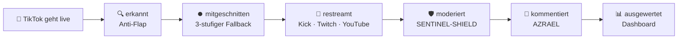
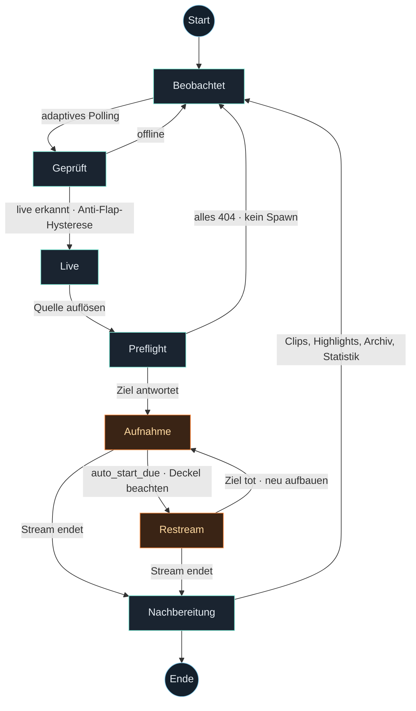
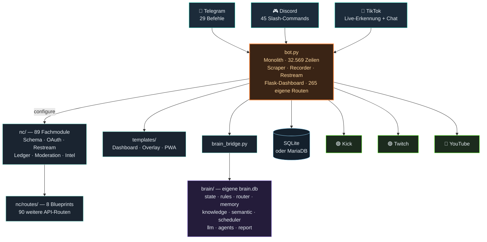
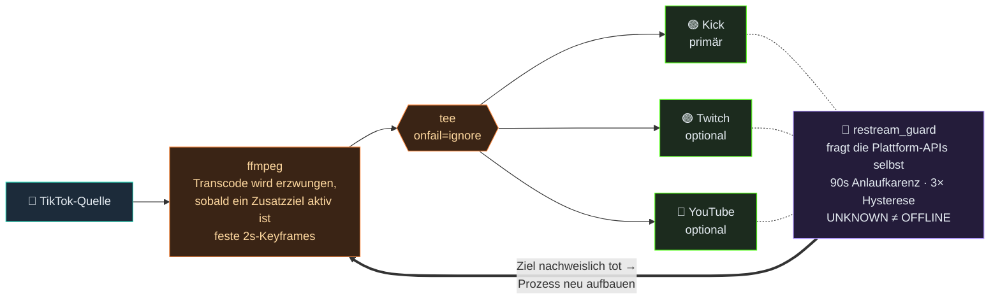

<div align="center">


### Der Kontrollraum für Live-Streaming
#### Überwachung · Aufnahme · Multi-Ziel-Restream · KI-Moderation

[](https://lafap.de)

[](LICENSE)
[](https://www.python.org/)
[](#-installation)
[](#-projektstatus)
[](../../actions/workflows/ci.yml)

[](#-bedienung)
[](#discord--45-slash-commands)
[](#-was-nightcrawler-macht)
[](#-restream)
[](#-restream)
[](#-restream)
[](docs/CHANGELOG.md)

[](https://lafap.de)
[](https://discord.gg/psvnxm7tSV)

<br>

> **Ein TikTok-Stream geht live → wird erkannt, mitgeschnitten, nach Kick/Twitch/YouTube
> weitergesendet, in allen drei Chats moderiert und kommentiert — vollautomatisch,
> auf einem einzigen Server, ohne Cloud-Abo.**

</div>



---

## 📋 Inhaltsverzeichnis

<table>
<tr><td>

- [✨ Was NIGHTCRAWLER macht](#-was-nightcrawler-macht)
- [🏗️ Architektur](#️-architektur)
- [⚡ Schnellstart](#-schnellstart)
- [📦 Installation](#-installation)
- [⚙️ Konfiguration](#️-konfiguration)

</td><td>

- [🕹️ Bedienung](#️-bedienung)
- [📡 Restream](#-restream)
- [🧠 Das Gehirn (AZRAEL)](#-das-gehirn-azrael)
- [🖥️ Dashboard](#️-dashboard)
- [🚀 Deployment](#-deployment)

</td><td>

- [🧪 Tests & Prüfkette](#-tests--prüfkette)
- [🛡️ Sicherheit](#️-sicherheit)
- [🗺️ Projektstruktur](#️-projektstruktur)
- [🤝 Mitwirken](#-mitwirken)
- [📄 Lizenz](#-lizenz)

</td></tr>
</table>

---

## ✨ Was NIGHTCRAWLER macht

<table>
<tr>
<td width="33%" valign="top">

### 🔍 Erkennen
Adaptives Polling auf getrackte TikTok-Kanäle mit **Anti-Flap-Hysterese** —
kein Fehlalarm bei kurzen Aussetzern. Abo-Streams werden separat erkannt und
gemeldet.

</td>
<td width="33%" valign="top">

### ⏺️ Aufnehmen
**Dreistufiger Recorder-Fallback**: nativ (ffmpeg) → streamlink → yt-dlp.
Preflight-Check vor jedem Spawn, damit kein ffmpeg minutenlang gegen eine
404 rennt.

</td>
<td width="33%" valign="top">

### 📡 Weitersenden
Multi-Ziel-**Restream** nach Kick, Twitch und YouTube gleichzeitig — mit
`tee`-Fan-out, automatischem Transcode und Ziel-Verifikation gegen die
Plattform-APIs.

</td>
</tr>
<tr>
<td valign="top">

### 🛡️ Moderieren
**SENTINEL-SHIELD**: deterministische Anti-Doxxing- und Hate-Erkennung mit
Leetspeak-, Homoglyphen- und Zero-Width-Normalisierung. Läuft **vor** jeder
KI und kostet kein Budget.

</td>
<td valign="top">

### 🤖 Mitreden
**AZRAEL**, der KI-Cohost, antwortet in Kick-, Twitch- und YouTube-Chat,
reagiert live auf den gesendeten Stream und blendet sich ins Sendebild ein.

</td>
<td valign="top">

### 📊 Auswerten
Flask-Dashboard mit **355 API-Routen**, Wissensgraph-Visualisierung,
Einnahmen-Journal (Finanzamt-tauglich, append-only mit Hash-Kette) und PWA
fürs Handy.

</td>
</tr>
</table>

<details>
<summary><b>🔎 Vollständige Feature-Liste aufklappen</b></summary>

<br>

| Bereich | Funktion |
|---|---|
| **Live-Erkennung** | Adaptives Polling · Anti-Flap-Hysterese · Abo-Stream-Erkennung · Proxy-/SOCKS-Support · Cookie-Rotation |
| **Aufnahme** | Dreistufiger Recorder-Fallback · Preflight-GET vor Spawn · Suffix-Fallback für CDN-Quirks · Recording-Wächter gegen eingefrorene Mitschnitte · S3-Backup (optional) |
| **Restream** | Kick / Twitch / YouTube parallel · `tee` mit `onfail=ignore` · erzwungener Transcode bei Multi-Ziel · Ziel-Verifikation über Plattform-APIs · Wiederanlauf nach Neustart · sicherer Test-Push ohne Broadcast-Risiko · Deckel für gleichzeitige Restreams |
| **Chat & Moderation** | SENTINEL-SHIELD (Doxxing / Hate / Drohung) · geteilte Moderations-Heuristik über Kick, Twitch, YouTube · Fremdwerbungs-Erkennung mit Eigen-Allowlist · Banned-Words · Timeout-Eskalation |
| **KI (AZRAEL)** | Chat-Antworten auf Ansprache · Live-Reaktionen aufs Sendebild · Sprachausgabe (Piper) · Persona-System · Multi-Backend: llama.cpp → Ollama → freie APIs → OpenAI/Anthropic · Budget- und Tier-Steuerung |
| **Gehirn (`brain/`)** | Zustandsmaschine · regelbasierte Tier-1-Entscheidungen mit Warum-Log · Langzeitgedächtnis · Wissensgraph (Triple-Store) · semantische Suche · Prognosen · Wochenreport |
| **Sentinel-Flotte** | 13 Wächter-Agenten (health, recovery, scout, analytics, learning, sentinel, disk, swap, restream, toxicity, uptime, recording, proxy) mit Telegram-Alarm, einzeln abschaltbar |
| **Community** | Wiedererkennung von Stammzuschauern · Loyalty-Punkte & Ränge · Discord-XP, Level, Daily-Streak · Live-Ping · Highlight-Share · Community-Events |
| **Geld** | Spenden-Telemetrie (Schätzwerte) · getrenntes Einnahmen-Journal (`nc/ledger.py`) mit Hash-Kette und CSV-Export fürs Finanzamt |
| **Dashboard** | 355 Flask-Routen · Live-Panels · Gehirn-Visualisierung mit Lernkurve · Overlay für OBS · installierbare PWA (Android) · QR-Login |
| **Betrieb** | systemd-Dienst · Deploy-Skript mit Vorabprüfung und Auto-Rollback · Selbsttest-Route · Totmann-Meldung bei Prozesstod · CrowdSec-Anbindung · Log-Redaction für Cookies und Stream-Keys |
| **Datenbank** | SQLite **oder** MariaDB · zentrales Schema-Modul · Export-Werkzeug · SQL-Guard |

</details>

### Der Lebenszyklus eines Streams



---

## 🏗️ Architektur



> [!IMPORTANT]
> **Die Architektur-Grenze, die gilt:** `nc/*` und `brain/*` importieren **niemals**
> aus `bot.py`. Konfiguration kommt ausschließlich per `configure(...)`-Injection.
> Das hält beide Bibliotheken isoliert testbar und verhindert Zirkularimporte.
> `brain/` ist thread-basiert und stdlib-only.

---

## ⚡ Schnellstart

```bash
git clone https://github.com/itsamemedev/Telegram-Stream-Info-Bot.git
cd Telegram-Stream-Info-Bot

python3 -m venv .venv && source .venv/bin/activate
pip install -r requirements.txt
sudo apt install -y ffmpeg streamlink yt-dlp

cp .env.example .env && nano .env      # mindestens BOT_TOKEN eintragen
python3 bot.py
```

Dashboard danach unter <http://127.0.0.1:8050> — von außen nur per SSH-Tunnel,
siehe [Sicherheit](#️-sicherheit).

---

## 📦 Installation

### Schnellweg — geführtes Installationsskript

Wer nicht jeden Schritt selbst gehen will: die Skripte richten alles ein,
**erklären dabei jeden Schritt** und fragen vor jedem Eingriff. Optionale
Bausteine (Discord, Restream-Ziele, Transkription, MariaDB, CrowdSec, lokales
LLM) werden einzeln angeboten; wo ein Passwort frei wählbar ist, bieten sie an,
eines zu erzeugen.

```bash
# Ubuntu · Debian · Raspberry Pi OS · macOS
git clone https://github.com/itsamemedev/Telegram-Stream-Info-Bot.git ~/nightcrawler
bash ~/nightcrawler/tools/installer.sh          # --express = weniger Fragen, --unattended = keine
```

```bat
rem Windows
tools\install.bat
```

Beide legen venv und `.env` an, installieren die Systempakete, prüfen mit
`bot.py --selfcheck` nach und richten auf Wunsch Autostart ein — unter Linux
systemd samt Totmann-Meldung und der Status-MOTD (`tools/motd.sh`), unter macOS
launchd, unter Windows die Aufgabenplanung. Ein zweiter Lauf aktualisiert eine
bestehende Installation, statt sie zu überbügeln.

> [!NOTE]
> **Python 3.12 ist harte Mindestversion** (siehe unten). Debian 12 und
> Raspberry Pi OS bookworm liefern 3.11 — das Skript erkennt das und bietet
> einen Weg zu einem neueren Interpreter an.

Wer lieber selbst Hand anlegt, findet den ausführlichen Weg hier:

### Voraussetzungen

| | Mindestens | Empfohlen |
|---|---|---|
| **Betriebssystem** | Linux mit systemd | Ubuntu 22.04 / 24.04 LTS |
| **Python** | 3.12 | 3.13 |
| **CPU** | 4 Kerne | 8 Kerne (Transcode ohne GPU) |
| **RAM** | 4 GB | 16 GB (mit lokalem LLM) |
| **Platte** | 20 GB | 200 GB+ (Aufnahmen) |
| **Netz** | 10 Mbit Upload | 50 Mbit+ (Multi-Restream) |

> [!IMPORTANT]
> **Python 3.12 ist harte Mindestversion.** `bot.py` nutzt f-strings mit
> Backslash (PEP 701) — unter 3.11 scheitert schon das Parsen der Datei.

<details>
<summary><b>Schritt 1 — Systempakete</b></summary>

<br>

Diese vier kommen **nicht** über `pip`, sondern über den Paketmanager:

```bash
sudo apt update
sudo apt install -y python3 python3-venv python3-pip ffmpeg streamlink yt-dlp
```

| Paket | Wofür |
|---|---|
| `ffmpeg` | Aufnahme, Restream, Overlay-Einblendung |
| `streamlink` | Quellenauflösung |
| `yt-dlp` | Rückfall-Auflösung (403-Lebenszyklus) |
| `crowdsec` | *optional* — Abwehr-Panel im Dashboard (`cscli`) |

</details>

<details>
<summary><b>Schritt 2 — Projekt und virtuelle Umgebung</b></summary>

<br>

```bash
git clone https://github.com/itsamemedev/Telegram-Stream-Info-Bot.git ~/nightcrawler
cd ~/nightcrawler

python3 -m venv .venv
source .venv/bin/activate
pip install --upgrade pip
pip install -r requirements.txt
```

> [!NOTE]
> `requirements.txt` lässt die Versionen bewusst offen. Sobald der Bot bei dir
> läuft, friere den **nachweislich funktionierenden** Stand ein:
> ```bash
> python3 -m pip freeze > requirements.lock.txt
> ```
> Das ist besonders für `TikTokLive` wichtig — die Bibliothek hängt an einer
> undokumentierten API und kann von einem Tag auf den anderen brechen.

</details>

<details>
<summary><b>Schritt 3 — Konfiguration anlegen</b></summary>

<br>

```bash
cp .env.example .env
chmod 600 .env
nano .env
```

Die Vorlage ist **auto-generiert** aus dem Quellcode und listet alle
Konfigurationsvariablen mit ihren Defaults. Auskommentierte Zeilen = Default
aktiv. Neu erzeugen nach Code-Änderungen:

```bash
python3 tools/gen_env_example.py
```

</details>

<details>
<summary><b>Schritt 4 — Datenbank</b></summary>

<br>

Die Datenbank legt sich beim ersten Start **selbst** an — nichts zu tun.
Standard ist SQLite; für MariaDB in der `.env`:

```ini
DB_BACKEND=mariadb
DB_HOST=127.0.0.1
DB_NAME=nightcrawler
DB_USER=nightcrawler
DB_PASS=…
```

</details>

<details>
<summary><b>Schritt 5 — Erster Start</b></summary>

<br>

```bash
python3 bot.py
```

Erwartete Zeilen im Log:

```
Recorder-Inventur:  ffmpeg : /usr/bin/ffmpeg   yt-dlp : /usr/bin/yt-dlp
Discord verbunden als <bot> — 45 Slash-Commands aktiv.
Brain-LLM: llama.cpp OK   (oder: KEIN Backend erreichbar → Fallback)
Dashboard läuft auf 127.0.0.1:8050
```

Läuft alles, richte den [systemd-Dienst](#-deployment) ein.

</details>

<details>
<summary><b>Optional — lokales LLM (llama.cpp)</b></summary>

<br>

Für KI-Antworten ohne Cloud und ohne Kosten: siehe **[`docs/SETUP_LLAMACPP.md`](docs/SETUP_LLAMACPP.md)**
und die mitgelieferte Unit **[`llama-server.service`](llama-server.service)**.
Ist kein llama.cpp erreichbar, fällt der Bot automatisch auf Ollama und danach
auf die keylosen freien Backends zurück — er startet **nie** deswegen nicht.

</details>

---

## ⚙️ Konfiguration

Alle Einstellungen leben in `.env`. Die Vorlage `.env.example` kennt **rund 495 Variablen** — das Minimum ist klein:

### 🔑 Pflicht

```ini
BOT_TOKEN=123456:ABC-DEF…            # Telegram-Bot von @BotFather
ADMIN_CHAT_ID=123456789              # deine Telegram-ID (Alarme, Admin-Befehle)
```

### 🎛️ Häufig gesetzt

<table>
<tr><th>Bereich</th><th>Variablen</th></tr>
<tr><td><b>Discord</b></td><td><code>DISCORD_TOKEN</code>, <code>DISCORD_GUILD_ID</code>, <code>DISCORD_ADMIN_ROLE</code></td></tr>
<tr><td><b>Restream</b></td><td><code>KICK_STREAM_KEY</code>, <code>TWITCH_ENABLED</code>, <code>TWITCH_STREAM_KEY</code>, <code>YOUTUBE_ENABLED</code>, <code>YOUTUBE_STREAM_KEY</code>, <code>RESTREAM_SINGLE</code>, <code>RESTREAM_MAX_CONCURRENT</code>, <code>RESTREAM_BITRATE_K</code>, <code>RESTREAM_FPS</code></td></tr>
<tr><td><b>KI</b></td><td><code>AI_PROVIDER</code>, <code>REACTION_AI_PROVIDER</code>, <code>BRAIN_LLM_TIMEOUT_S</code>, <code>BRAIN_LLM_MAX_TOKENS</code>, <code>OPENAI_API_KEY</code>, <code>ANTHROPIC_API_KEY</code>, <code>POLLINATIONS_API_KEY</code></td></tr>
<tr><td><b>Moderation</b></td><td><code>SENTINEL_SHIELD</code>, <code>MOD_BLOCK_ADS</code>, <code>AZRAEL_CHAT_REPLY</code>, <code>AZRAEL_REACT_ONLY_LIVE</code></td></tr>
<tr><td><b>Dashboard</b></td><td><code>DASHBOARD_HOST</code>, <code>DASHBOARD_PORT</code>, <code>DASHBOARD_TOKEN</code></td></tr>
<tr><td><b>Datenbank</b></td><td><code>DB_BACKEND</code>, <code>DB_HOST</code>, <code>DB_NAME</code>, <code>DB_USER</code>, <code>DB_PASS</code></td></tr>
</table>

### 🔐 OAuth einrichten

| Plattform | Anleitung |
|---|---|
| Twitch | **[`docs/SETUP_TWITCH_OAUTH.md`](docs/SETUP_TWITCH_OAUTH.md)** |
| YouTube | **[`docs/SETUP_YT_OAUTH.md`](docs/SETUP_YT_OAUTH.md)** |
| Kick | User-OAuth direkt im Dashboard-Panel (Titel & Kategorie setzen) |

> [!WARNING]
> **`.env` gehört niemals ins Repository.** Sie enthält Cookies, OAuth-Tokens und
> Stream-Keys. Die `.gitignore` sperrt sie bereits — ein einmal committetes
> Geheimnis steht auch nach dem Löschen noch in der Historie.

---

## 🕹️ Bedienung

### Telegram

| Befehl | Wirkung |
|---|---|
| `/start` · `/about` | Einstieg, Bot-Info |
| `/track <user>` · `/track_exact <user>` | Streamer aufnehmen ins Tracking |
| `/untrack <user>` · `/tracklist` | Entfernen / Übersicht |
| `/live` · `/tiktok` | Wer ist gerade live |
| `/bulkadd` | Viele Streamer auf einmal tracken |
| `/recstatus` · `/stoprec` · `/cleanup` | Aufnahmen: Status, Stopp, Aufräumen |
| `/stats` · `/topusers` · `/summary` | Auswertungen |
| `/ai <frage>` · `/aireset` | AZRAEL fragen / Verlauf zurücksetzen |
| `/brain` · `/brain teste` · `/report` | Gehirn-Status, Selbsttest, Wochenreport |
| `/diag` · `/sysres` · `/quota` · `/logs` | Diagnose, Ressourcen, Kontingente, Logs |
| `/pause` · `/resume` | Tracking anhalten / fortsetzen |
| `/update` | Selbstaktualisierung aus dem Repo |
| `/cookies` · `/teststream` | Cookie-Zustand, Teststream |
| `/einnahmen` | Einnahmen-Journal (Buchen, Jahresübersicht) |

<details>
<summary><h3>Discord — 45 Slash-Commands</h3></summary>

<br>

**Stream & Bot**
`/status` · `/track` · `/untrack` · `/tracklist` · `/livenow` · `/recstatus` ·
`/restream_status` · `/stats` · `/streaminfo` · `/topstreamers` · `/botstats` ·
`/post_test` · `/sys_report` · `/sys_unpause`

**KI**
`/ai` · `/ask`

**Community & Gamification**
`/rank` · `/profile` · `/leaderboard` · `/daily` · `/follow` · `/unfollow` ·
`/event` · `/events` · `/help`

**Clips**
`/clip` · `/clips` · `/clipoftheweek`

**Moderation** *(Admin-Rolle nötig)*
`/ban` · `/kick` · `/timeout` · `/warn` · `/warnings` · `/clearwarns` · `/purge`

**Server-Aufbau** *(Admin-Rolle nötig)*
`/setup_community` · `/setup_targets` · `/create_channel` · `/create_voice` ·
`/create_category` · `/create_role` · `/create_group` · `/assign_role` ·
`/remove_role` · `/set_channel_perms`

> Die `/sys_*`-Kommandos führen die **Original-Telegram-Handler** über einen
> Update/Context-Shim aus — null Duplikate, Telegram-Fixes wirken automatisch
> auch in Discord.

</details>

---

## 📡 Restream



**Scharf schalten** — in der `.env`:

```ini
KICK_STREAM_KEY=…
TWITCH_ENABLED=1
TWITCH_STREAM_KEY=…
YOUTUBE_ENABLED=1
YOUTUBE_STREAM_KEY=…
RESTREAM_MAX_CONCURRENT=2
```

<details>
<summary><b>Warum Multi-Ziel ohne Transcode nicht funktioniert</b></summary>

<br>

Im Copy-Modus teilt der `tee` denselben H.264-Bitstream an alle Ziele — aber
Kick, Twitch und YouTube haben unterschiedliche Keyframe-/GOP-Anforderungen.
Mindestens ein Ziel lehnt den Stream dann ab oder ruckelt. Deshalb erzwingt
NIGHTCRAWLER Transcode, sobald ein Zusatzziel aktiv ist, und erzeugt ein
plattformkonformes GOP, das alle drei gleichzeitig akzeptieren.

Kosten: Transcode braucht CPU. Auf einem Server ohne GPU notfalls
`RESTREAM_BITRATE_K` / `RESTREAM_FPS` senken.

</details>

<details>
<summary><b>Warum „online" nicht „Prozess läuft" heißt</b></summary>

<br>

Twitch und YouTube tragen im `tee`-Muxer `onfail=ignore` — damit ein klemmendes
Twitch nicht Kick mitreißt. Genau deshalb läuft ffmpeg weiter, wenn sie
wegbrechen: das Panel zeigte drei grüne Ziele, während auf zwei Plattformen
nichts ankam.

`_restream_verify_loop` fragt deshalb periodisch die **Plattformen selbst** ab
(Kick keyless, Twitch Helix, YouTube Data API) und baut den Restream neu auf,
wenn ein Ziel nachweislich tot ist. Vier Regeln in `nc/restream_guard.py`
verhindern Neustart-Schleifen:

1. **Anlaufkarenz 90 s** — RTMP braucht bis zu einer Minute bis „live".
2. **Hysterese** — drei Fehlanzeigen in Folge, nicht eine.
3. **UNKNOWN ≠ OFFLINE** — ein API-Timeout ist kein Beweis für einen toten Stream.
4. **Deckel** — `RESTREAM_MAX_CONCURRENT` begrenzt parallele Encodes.

</details>

<details>
<summary><b>Test-Push: Ziel prüfen ohne Broadcast-Risiko</b></summary>

<br>

`nc/restream_testpush.py` schickt einen kurzen, synthetischen Push an ein
konfiguriertes Ziel und meldet, ob der Ingest ihn annimmt — bevor du live gehst
und es der Zuschauer merkt.

</details>

---

## 🧠 Das Gehirn (AZRAEL)

`brain/` ist ein eigenständiger, bot-freier KI-Kern mit eigener Datenbank.
**Fehlt das Verzeichnis, startet der Bot exakt wie ohne** — jeder Baustein ist
additiv, fail-open und einzeln abschaltbar.

| Modul | Aufgabe |
|---|---|
| `state.py` | Zustandsmaschine — Systemspiegel, Übergänge |
| `rules.py` | Regel-Engine (Tier 1) — LLM-frei, mit Warum-Log |
| `router.py` | Task-Router: `rules → db → knowledge → llm` |
| `memory.py` | Langzeitgedächtnis (Sessions, Metriken) |
| `knowledge.py` | Wissensgraph (Triple-Store, erklärbar) |
| `semantic.py` | Semantische Suche |
| `scheduler.py` | Prognosen und Poll-Hints |
| `llm.py` | LLM-Runtime: llama.cpp → Ollama → Fallback |
| `agents.py` | Sentinel-Flotte (13 Wächter, einzeln schaltbar) |
| `report.py` | Wochenreport in Markdown |

### 🛰️ Die Sentinel-Flotte

| Agent | Wacht über |
|---|---|
| `health` | Gesamtzustand, Health-Score |
| `recovery` | Selbstheilung: Restarts, Gates |
| `scout` | Neue Quellen und Chancen |
| `analytics` | Kennzahlen und Trends |
| `learning` | Lernfortschritt des Wissensgraphen |
| `sentinel` | CrowdSec — Angriffsspitzen, blinde Abwehr |
| `disk` | Freier Platz + Schätzung „Stunden bis voll" |
| `swap` | Swap-Belegung — räumt bei RAM-Puffer selbst auf (`SWAP_CLEAR_CMD`) |
| `restream_sentinel` | **Still** scheiternde Restream-Ziele, geteilte Keys |
| `toxicity` | Chat-Toxizitäts-**Welle** (möglicher Raid) |
| `uptime` | Chat-Verbindungen je Plattform, Reconnect-Flattern |
| `recording` | Aufnahmen mit lebender PID, aber nicht wachsender Datei |
| `proxy` | Erfolgs- und 403-Quote der TikTok-Fetches (Server-IP-/Proxy-Block) |

Jeder Agent ist isoliert — ein toter Agent kann den Tick nie killen. Abschalten
per `BRAIN_AGENT_<NAME>=0`.

### 🛡️ SENTINEL-SHIELD

Deterministische Erkennung **vor** Banned-Words und **vor** jeder KI:

- **Anti-Doxxing** — Telefonnummern, IBAN, Wohnadressen, Koordinaten, E-Mail, Klarnamen-Ansagen
- **Anti-Hate/Drohung** — Volksverhetzung inkl. Code-Zahlen (mit Kaufkontext-Guard), Suizid-Aufforderung, Gewaltandrohung
- **Tarnungs-Normalisierung** — Leetspeak, Unicode-Homoglyphen (`ѕіеg` → `sieg`), Zero-Width-Zeichen, Diakritika (NFKD), Trennzeichen (`h-e-i-l`)

> [!NOTE]
> Der Shield ist bewusst auf **null False Positives** getrimmt: `Sieglinde`,
> `1488 euro`, `heiliger`, `e-mail` und echtes Kyrillisch bleiben unangetastet.
> Bei Moderation ist ein zu Unrecht bestrafter Zuschauer schlimmer als ein
> durchgerutschter Troll. Abschalten: `SENTINEL_SHIELD=0`.

---

## 🖥️ Dashboard

Flask-Dashboard mit **355 Routen** unter `127.0.0.1:8050`.

```bash
# Von deinem Laptop — niemals den Port öffnen:
ssh -L 3000:localhost:8050 ubuntu@<server-ip>
# Dann im Browser:  http://localhost:3000
```

| Seite | Inhalt |
|---|---|
| `/` | Hauptkontrollraum: Live, Aufnahmen, Restream, Community, Geld, Abwehr |
| `/brain` | Gehirn: Wissensgraph, Lernkurve, Sentinel-Flotte, Agenten-Log |
| `/overlay` | OBS-Overlay: AZRAEL-Sprechblase, Donation-Box, Titel |
| `/api/selftest` | **„Was ist gerade kaputt?"** — jeder Befund mit dem Befehl, der ihn behebt |

### 📸 Screenshots

<!--
  Hier gehoeren echte Screenshots hin — sie sind das Einzige, was ein fremder
  Besucher nicht aus dem Code herauslesen kann, und der groesste Hebel fuer den
  ersten Eindruck. Vorgehen:

    1. ssh -L 3000:localhost:8050 ubuntu@<server-ip>
    2. http://localhost:3000 im Browser, Fenster auf 1440x900
    3. Aufnehmen: Hauptkontrollraum, /brain, /overlay, PWA auf dem Handy
    4. VORHER schwaerzen: Stream-Keys, Tokens, Klarnamen im Chat,
       Zuschauernamen, Betraege im Einnahmen-Panel
    5. Ablegen unter docs/assets/ und die Tabelle unten einkommentieren

  | Kontrollraum | Gehirn |
  |---|---|
  |  |  |
  | **Overlay im Sendebild** | **PWA auf dem Handy** |
  |  |  |
-->

> [!NOTE]
> Screenshots folgen. Das Dashboard zeigt Live-Betriebsdaten — die Bilder müssen
> vor der Veröffentlichung von Stream-Keys, Tokens und Zuschauernamen befreit
> werden. Die Anleitung dafür steht als Kommentar in der Quelle dieses
> Abschnitts.

### 📱 Als App aufs Handy (PWA)

Das Dashboard ist eine **Progressive Web App** — Chrome öffnen → Menü → „Zum
Startbildschirm hinzufügen". Startet dann im Vollbild mit eigenem Icon, ohne
Play-Store und ohne APK. Braucht HTTPS, also über deine Domain statt über die
lokale IP.

> [!IMPORTANT]
> Der Service Worker cacht **niemals** `/api/`-Antworten. Das ist ein
> Live-Kontrollpanel — gecachte API-Daten würden veralteten Bot-Status zeigen
> („live", obwohl offline). Nur die statische Shell wird gecacht.

---

## 🚀 Deployment

### systemd-Dienst

```ini
# /etc/systemd/system/nightcrawler.service
[Unit]
Description=NIGHTCRAWLER
After=network-online.target

[Service]
Type=simple
User=ubuntu
WorkingDirectory=/home/ubuntu/nightcrawler
ExecStart=/home/ubuntu/nightcrawler/.venv/bin/python3 bot.py
Restart=always
RestartSec=10

[Install]
WantedBy=multi-user.target
```

```bash
sudo systemctl daemon-reload
sudo systemctl enable --now nightcrawler
journalctl -u nightcrawler -f          # Strg+C beendet nur das Mitlesen
```

### Sicheres Ausrollen — `tools/deploy.sh`

```bash
bash tools/deploy.sh <build.zip>
```

Das Skript packt den neuen Build zuerst in ein **Nebenverzeichnis** und prüft
ihn dort komplett durch — `py_compile`, `pyflakes`, `ruff`, alle Testläufe,
`ncpatch check`, `node --check` auf die Dashboard-Skripte. Der laufende Bot wird
dabei **nicht angefasst**.

Erst wenn alles grün ist, wird gestoppt, umgeschwenkt und gestartet. Danach
prüft es selbst nach: läuft der Dienst, antwortet das Dashboard, was sagt der
Selbsttest. Geht etwas schief, **spielt es das Backup automatisch zurück**.
Scheitert die Vorabprüfung, passiert gar nichts.

```bash
BOT_DIR=~/mein-bot SERVICE=meinbot bash tools/deploy.sh <build.zip>
```

### Totmann-Meldung *(dringend empfohlen)*

Stirbt der Prozess ganz, sagt dir das sonst **niemand**:

```bash
chmod +x tools/notify_failure.sh
sudo systemctl edit nightcrawler     # → [Unit] OnFailure=nightcrawler-notify@%n.service
```

Danach kommt bei jedem Ausfall eine Telegram-/Discord-Nachricht mit den letzten
Logzeilen.

Ausführlich: **[`docs/DEPLOY.md`](docs/DEPLOY.md)** und **[`docs/START_HIER.txt`](docs/START_HIER.txt)**.

---

## 🧪 Tests & Prüfkette

> [!CAUTION]
> **Diese Kette läuft vor jeder Auslieferung — vollständig, nicht auszugsweise.**

```bash
python3 -m py_compile <geänderte .py>
python3 -m pyflakes   <geänderte .py>                      # 0 Befunde
python3 -m ruff check --select F,E9,B --ignore B905 <geänderte .py>
python3 tools/ncpatch.py check                             # Templates prüfen
python3 test_smoke.py
python3 test_nc_modules.py
python3 test_restream.py
```

| Test | Deckt ab |
|---|---|
| `test_smoke.py` | Führt `bot.py` **wirklich** aus — NameError, Reihenfolge-Fallen. Braucht den ganzen Laufzeitstack, gehört auf den Server. |
| `test_nc_modules.py` | Die Fachmodule in `nc/` isoliert, ohne Netz und ohne DB |
| `test_restream.py` | Statische Verträge gegen den Restream-Pfad |
| `test_m2_bridge.py` | Adapter Bot ↔ `brain/` |
| `brain/test_m*.py` | Die Gehirn-Module einzeln |
| `nc/intel/test_intel.py` | Archiv-Index, Transkripte, Reels |

Die Modultests in `brain/` und `nc/intel/` brauchen das Projektwurzel-Verzeichnis
im Suchpfad:

```bash
PYTHONPATH=. python3 brain/test_m1.py
PYTHONPATH=. python3 nc/intel/test_intel.py
```

Was ohne den vollen Laufzeitstack prüfbar ist, läuft bei jedem Push automatisch:
**[`.github/workflows/ci.yml`](.github/workflows/ci.yml)** — Lint, Templates,
Verträge und ein Geheimnis-Scan auf Python 3.12 und 3.13.

<details>
<summary><b>Wenn ein Vertrag in <code>test_restream.py</code> kippt</b></summary>

<br>

Die statischen Verträge verankern sich an **wörtlichem Quelltext** von
`bot.py`. Ändert sich eine Signatur, kippt der Vertrag, obwohl der Code
stimmt. Ebenso bei Fenstern der Form `src[i:i + 3000]`: wächst eine Funktion
darüber hinaus, meldet der Test etwas als fehlend, das zwei Zeilen weiter unten
steht.

**Vor jedem Fix am Code erst prüfen, ob der Vertrag oder nur sein Anker
gebrochen ist.**

</details>

### 🧭 Navigation im Monolithen

`bot.py` hat über 32.000 Zeilen. Es wird **nie** ganz gelesen und **nie**
blind durchsucht — erst fragen wo etwas steht, dann den Ausschnitt holen:

```bash
python3 tools/ncpatch.py find "donations"              # wo ist X?
python3 tools/ncpatch.py sym  bot.py api_brain     # Zeilenbereich eines Symbols
python3 tools/ncpatch.py show bot.py 24750 24810   # nur diesen Ausschnitt
python3 tools/ncpatch.py grep "tree.command" bot.py -C 3
python3 tools/ncpatch.py map                           # Navigationskarte neu bauen
python3 tools/ncpatch.py verify patches/x.json         # Trockenlauf
python3 tools/ncpatch.py apply  patches/x.json         # alles-oder-nichts, legt .bak an
```

`find` antwortet aus **[`.claude/INDEX.md`](.claude/INDEX.md)** — 355 Routen
(265 in `bot.py`, 90 in `nc/routes/`), 45 Slash-Commands, 565 Funktionen,
jeweils mit Zeilennummer.

---

## 🛡️ Sicherheit

| Regel | Warum |
|---|---|
| **`.env` liegt nie im Repo und nie im Archiv** | ~495 Variablen inkl. Cookies, OAuth-Tokens und Stream-Keys |
| **Dashboard bindet auf `127.0.0.1`** | Zugriff läuft über SSH-Tunnel, nicht über einen offenen Port |
| **Cookie- und Key-Redaction beim Logging** | `streamlink`/`ffmpeg`-Kommandozeilen werden vor dem Loggen bereinigt |
| **Ledger ist append-only mit Hash-Kette** | Eine Korrektur ist eine Gegenbuchung, kein Überschreiben |
| **CrowdSec-Anbindung** | Angriffsspitzen sichtbar im Dashboard, Wächter meldet blinde Abwehr |
| **PWA-Icon-Routen mit Whitelist** | Schutz gegen Path-Traversal |

> [!WARNING]
> **Geld nicht vermischen.** `/api/donations/summary` ist Live-Telemetrie aus
> **Schätzwerten**. `nc/ledger.py` sind gebuchte **Auszahlungen** für die Steuer.
> Niemals das eine aus dem anderen ableiten — Anzeigewert ≠ Auszahlung ≠
> Zuflusszeitpunkt. TikTok-Gifts gehen an den getrackten Streamer, nicht an
> eigene Kanäle: sie werden als `kind="gift"` gespeichert, nie als `donation`,
> und laufen in **keine** Geldsumme.

Sicherheitslücke gefunden? → **[`docs/SECURITY.md`](docs/SECURITY.md)**. Bitte **kein**
öffentliches Issue.

---

## 🗺️ Projektstruktur

```
NIGHTCRAWLER/
├── bot.py                Monolith: Telegram + Discord + Flask + Scraper +
│                             Recorder + Restream + Schema
├── brain_bridge.py           Adapter  Bot ↔ brain/
│
├── brain/                    KI-Kern (bot-frei, eigene DB, stdlib-only)
│   ├── state.py  rules.py  router.py  memory.py  knowledge.py
│   ├── semantic.py  scheduler.py  llm.py  agents.py  report.py
│   └── test_m*.py            Modultests
│
├── nc/                       89 Fachmodule (bot-frei, configure()-Injection)
│   ├── schema.py             zentrales DB-Schema
│   ├── restream_*.py         Ziele, Guard, Test-Push, Utils
│   ├── ledger.py             Einnahmen-Journal (Hash-Kette)
│   ├── twitchoauth.py  ytoauth.py  kick_oauth.py
│   ├── modheuristics.py  shield.py  replygate.py
│   ├── freeai.py  claude.py  piper_voices.py
│   ├── routes/               8 Flask-Blueprints (90 API-Routen)
│   ├── intel/                Archiv-Index, Transkripte, Reels
│   └── _vendor/segno/        vendored QR-Encoder (BSD)
│
├── templates/                dashboard.html · brain.html · overlay.html
│                             manifest.webmanifest · sw.js · PWA-Icons
├── website/                  öffentliche Seite, Impressum, Datenschutz
├── tools/                    ncpatch.py · deploy.sh · build_release.py
│                             gen_env_example.py · notify_failure.sh
├── docs/                     DEPLOY · CONTRIBUTING · CHANGELOG · SETUP_* · …
├── .claude/                  INDEX.md (Navigationskarte) + Skills
│
├── .env.example              auto-generierte Konfigurationsvorlage
├── requirements.txt          Laufzeitabhängigkeiten
├── llama-server.service      systemd-Unit fürs lokale LLM
└── test_*.py                 Smoke-, Modul- und Vertragstests
```

### 📚 Weiterführende Dokumente

| Datei | Inhalt |
|---|---|
| **[`docs/START_HIER.txt`](docs/START_HIER.txt)** | Einspielen in einem Befehl, Log lesen, Erste Hilfe |
| **[`docs/DEPLOY.md`](docs/DEPLOY.md)** | Vollständige Deploy- und Prüfanleitung |
| **[`docs/README_V37.md`](docs/README_V37.md)** | Ausführliche Release-Historie aller Wellen |
| **[`docs/CHANGELOG.md`](docs/CHANGELOG.md)** | Versionsübersicht |
| **[`docs/MODULARISIERUNG.md`](docs/MODULARISIERUNG.md)** | Plan, den Monolithen zu zerlegen — gemessen, in Wellen |
| **[`docs/SETUP_LLAMACPP.md`](docs/SETUP_LLAMACPP.md)** | Lokales LLM einrichten |
| **[`docs/SETUP_TWITCH_OAUTH.md`](docs/SETUP_TWITCH_OAUTH.md)** · **[`docs/SETUP_YT_OAUTH.md`](docs/SETUP_YT_OAUTH.md)** | OAuth-Flows |
| **[`docs/CROWDSEC.md`](docs/CROWDSEC.md)** | Abwehr-Panel |
| **[`CLAUDE.md`](CLAUDE.md)** | Arbeitsgrundlage für KI-gestützte Entwicklung |

---

## 🩺 Fehlersuche

<details>
<summary><b>„Es geht nicht mehr" — wo zuerst schauen</b></summary>

<br>

```bash
curl -s localhost:8050/api/selftest | python3 -m json.tool
```

Fasst zusammen, was sonst fünf verschiedene Log-Greps wären: tote Sendeziele,
YouTube-Grund, Abwehr-Rechte, gestörte Dauerschleifen, schweigende Kern-Loops,
Plattenfüllstand — **jeder Befund mit dem Befehl, der ihn behebt**.

</details>

<details>
<summary><b>Stille <code>except</code>-Blöcke sind der Hauptfeind</b></summary>

<br>

Der Bot fängt großflächig ab und loggt auf `warning`/`debug`. Ein `log.warning`
erscheint in einem ERROR-Log **nie** — so blieb ein Discord-Gateway-Tod
monatelang unsichtbar. Wenn etwas „nicht mehr geht", suche zuerst das `except`,
das den Grund frisst.

Für periodische Schleifen gibt es `_loop_fehler(name, exc)`: erste Meldung
sofort auf `error` mit Traceback, danach höchstens alle 15 Minuten eine — mit
der Zahl der unterdrückten Fälle.

</details>

<details>
<summary><b>Aufnahmen schlagen fehl</b></summary>

<br>

```
KEIN Recorder installiert — Aufnahmen werden FEHLSCHLAGEN.
```

```bash
sudo apt install ffmpeg        # empfohlen, für den nativen Pfad
pip install -U yt-dlp          # Fallback-Recorder
```

</details>

<details>
<summary><b>KI antwortet nicht / Antworten sind abgeschnitten</b></summary>

<br>

```bash
python3 -c "import nc.freeai as f; print(f.diagnose())"
```

Zeigt pro Backend: frei/gesperrt, Latenz, keyless/KEY, letzter Fehler. Bei
abgeschnittenen Antworten `BRAIN_LLM_MAX_TOKENS` erhöhen, bei Timeouts
`BRAIN_LLM_TIMEOUT_S` — beides hängt bei CPU-Inferenz zusammen.

`REACTION_AI_TIMEOUT` bleibt bewusst **kurz**: die Live-Reaktion muss snappy
sein, sonst schlägt der Watchdog Alarm.

</details>

<details>
<summary><b>Konfiguration wird nicht übernommen</b></summary>

<br>

**Modul-Konstanten frieren `.env` ein.** Die `.env` wird teilweise erst nach den
ersten Imports geladen. Konfiguration deshalb immer als Funktion lesen
(`_backend_conf()`), nie als Modul-Konstante.

</details>

---

## 📈 Projektstatus

**Produktiv im Dauerbetrieb** auf einem 8-Kern-Ubuntu-Server als systemd-Dienst.

| | |
|---|---|
| Aktuelle Version | **4.0** — „Restream Control Room" (2026.08) |
| Flask-Routen | 355 (265 in `bot.py` · 90 in `nc/routes/`) |
| Discord-Slash-Commands | 45 |
| Fachmodule | 89 in `nc/` (+8 in `nc/routes/`, +3 in `nc/intel/`), 10 in `brain/` |
| Sentinel-Agenten | 13 |
| Konfigurationsvariablen | ~495 |

Vollständige Historie: **[`docs/CHANGELOG.md`](docs/CHANGELOG.md)** ·
**[`docs/README_V37.md`](docs/README_V37.md)**

---

## 🧭 Roadmap

Der nächste grosse Schritt ist kein Feature, sondern Aufräumen: **`bot.py`
hat 32.569 Zeilen**. Die Datei ist der Engpass des Projekts — sie lässt sich
nicht überblicken und nur mit Werkzeug bearbeiten.

Der vollständige, gemessene Plan dazu steht in
**[`docs/MODULARISIERUNG.md`](docs/MODULARISIERUNG.md)**. Die Kurzfassung:

| Welle | Inhalt | Zeilen |
|---|---|---:|
| **0** | Fundament — `nc/ctx.py` für die 13 echten Querschnittshelfer | ±0 |
| **1** | Die 173 global-freien Funktionen bündeln | −2.200 |
| **2** | Blueprint-Pilot `/api/recordings` — beweist das Verfahren | −470 |
| **3** | Blueprints in Serie — **der grosse Hebel** | −7.600 |
| **4** | `RestreamManager` und `KickModerator` herauslösen | −1.700 |
| **5** | Discord-Schicht nach `discord_ext/` | −2.100 |
| **6** | Kern aufräumen, `bot.py` wird Kompositionswurzel | Rest |

Zwei Messungen machen das machbar: die Kopplung ist **flach** (Median 2
Fremdbezüge je Route, nur 13 echte Querschnittshelfer), und es gibt **kein
einziges `url_for`** im Projekt — Flask-Blueprints sind hier
verhaltensneutral.

Die Messlatte ist keine Zeilenzahl:

> **Eine neue API-Route anlegen, ohne `bot.py` zu öffnen.**

---

## 🤝 Mitwirken

Beiträge sind willkommen. **Bitte vorher [`docs/CONTRIBUTING.md`](docs/CONTRIBUTING.md)
lesen** — es gibt einige harte Regeln, die aus echten Ausfällen entstanden sind:

1. Die **Pflicht-Prüfkette** läuft vor jedem Pull Request.
2. `nc/*` und `brain/*` importieren **nie** aus `bot.py`.
3. Kommentare und Ausgaben auf **Deutsch**, und sie erklären **warum**, nicht was.
4. Kein `except: pass` in Dauerläufern — dafür gibt es `_loop_fehler`.

```bash
git checkout -b feature/mein-feature
# … ändern, Prüfkette laufen lassen …
git commit -m "Kurz und im Imperativ, was sich ändert"
git push -u origin feature/mein-feature
```

Auch hilfreich ohne Code: Bug-Reports mit Logausschnitt, Dokumentations-
Korrekturen, Übersetzungen.

Fragen, die kein Issue sind, gehören auf den **[Discord-Server](https://discord.gg/psvnxm7tSV)**.
Das Projekt im Betrieb sehen: **[lafap.de](https://lafap.de)**.

Bitte beachte den **[Verhaltenskodex](docs/CODE_OF_CONDUCT.md)**.

---

## 📄 Lizenz

<div align="center">

**GNU General Public License v3.0 oder später**

</div>

```
NIGHTCRAWLER — Kontrollraum für Live-Streaming
Copyright (C) 2026  Mr-Miner (itsamemedev)

Dieses Programm ist freie Software: Sie können es weitergeben und/oder
verändern, unter den Bedingungen der GNU General Public License, wie von der
Free Software Foundation veröffentlicht — Version 3 der Lizenz oder (nach
Ihrer Wahl) jede spätere Version.

Dieses Programm wird in der Hoffnung verteilt, dass es nützlich ist, aber
OHNE JEDE GEWÄHRLEISTUNG — sogar ohne die implizite Gewährleistung der
MARKTGÄNGIGKEIT oder EIGNUNG FÜR EINEN BESTIMMTEN ZWECK. Siehe die GNU
General Public License für weitere Einzelheiten.

Sie sollten eine Kopie der GNU General Public License zusammen mit diesem
Programm erhalten haben. Falls nicht: <https://www.gnu.org/licenses/>.
```

Volltext: **[`LICENSE`](LICENSE)** · Was das praktisch heißt:

| ✅ Erlaubt | ⚠️ Bedingung | ❌ Nicht erlaubt |
|---|---|---|
| Kommerzielle Nutzung | Quelltext offenlegen | Haftung |
| Veränderung | Gleiche Lizenz (GPLv3) | Gewährleistung |
| Weitergabe | Änderungen kennzeichnen | |
| Private Nutzung | Lizenz- und Copyright-Hinweis beilegen | |

Fremdcode und dessen Lizenzen: **[`docs/THIRD_PARTY_LICENSES.md`](docs/THIRD_PARTY_LICENSES.md)**

---

<div align="center">

**NIGHTCRAWLER v4.0 · „Restream Control Room"**

**[🌐 lafap.de](https://lafap.de)** · **[💬 Discord](https://discord.gg/psvnxm7tSV)** · **[📓 Changelog](docs/CHANGELOG.md)**

Wenn dir das Projekt hilft, lass einen ⭐ da.

</div>
