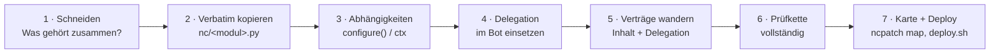
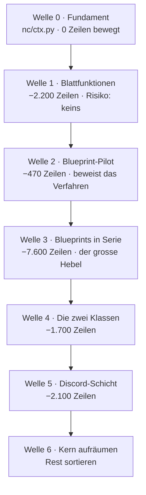

# Den Monolithen zerlegen — Plan

`bot.py` hat **34.487 Zeilen / 1,63 MB**. Diese Datei ist der Engpass des
Projekts: sie lässt sich nicht lesen, nicht überblicken und nur mit Werkzeug
(`ncpatch`) bearbeiten. Dieses Dokument sagt, wie sie kleiner wird, **ohne dass
der Bot dabei stehenbleibt**.

Alle Zahlen hier sind gemessen, nicht geschätzt — reproduzierbar mit
`python3 tools/ncpatch.py map` und den Skripten aus [Anhang A](#anhang-a--die-messungen-nachfahren).

---

## Inhalt

- [1 · Der Befund](#1--der-befund)
- [2 · Warum die bisherige Zerlegung stehen geblieben ist](#2--warum-die-bisherige-zerlegung-stehen-geblieben-ist)
- [3 · Die eine Regel, die alles trägt](#3--die-eine-regel-die-alles-trägt)
- [4 · Das Verfahren je Welle](#4--das-verfahren-je-welle)
- [5 · Die Wellen](#5--die-wellen)
- [6 · Was ausdrücklich nicht gemacht wird](#6--was-ausdrücklich-nicht-gemacht-wird)
- [7 · Risiken und Gegenmittel](#7--risiken-und-gegenmittel)
- [8 · Zielbild und Messlatte](#8--zielbild-und-messlatte)
- [Anhang A · Die Messungen nachfahren](#anhang-a--die-messungen-nachfahren)

---

## 1 · Der Befund

Der Monolith sieht schlimmer aus, als er ist. Vier Messungen entscheiden das.

### 1.1 Die Masse liegt in vier Blöcken

| Block | Zeilen | Anteil | Symbole |
|---|---:|---:|---:|
| **Flask-Routen** | 8.097 | 28 % | 345 |
| **Discord-Schicht** | 2.134 | 7 % | 45 Commands + 4 Events |
| **Zwei grosse Klassen** (`RestreamManager` 979, `KickModerator` 747) | 1.726 | 6 % | 2 |
| **Echte Blattfunktionen** (verstreut) | 867 | 3 % | 98 |
| Rest (Scraper, Recorder, Loops, Helfer) | ~15.000 | 51 % | ~500 |
| **Summe Symbolkörper** | **29.211** | | **920** |

Fast die Hälfte des Codes liegt in vier Blöcken, für die es jeweils **ein**
etabliertes Verfahren gibt. Das ist der Hebel.

### 1.2 Die Kopplung ist breit, aber flach

Der ganze Monolith hängt an zwei Namen:

| Global | gelesen von |
|---|---:|
| `dashboard_app` | **355** Funktionen |
| `log` | **240** Funktionen |
| `RECORDINGS_DIR` | 35 |
| `_KICK_MOD` | 27 |
| `_RESTREAM_MGR` | 19 |
| … 216 weitere | je < 20 |

`dashboard_app` ist nur der Flask-Dekorator — er verschwindet mit dem Umstieg
auf Blueprints von selbst. `log` ist ein Logger, also genau das, was
`configure(...)`-Injection seit 75 Wellen einspeist. **Die beiden mit Abstand
grössten Kopplungen sind die beiden billigsten.**

### 1.3 Fast alles ist Konfiguration, kein geteilter Zustand

Von 621 Zuweisungen auf Modulebene werden **nur 37 jemals per `global`
geschrieben** — und davon haben 32 genau *einen* schreibenden Eigentümer:

```
_COOKIE_REFRESH_DIRTY   → _capture_set_cookies, _persist_refreshed_cookies
_AI_SESSION             → _close_ai_session, _get_ai_session
_YTDLP_FAIL_STREAK      → _ytdlp_note_result
_whisper_model          → _whisper_get_model
…
```

Das sind **modul-lokale Caches, keine geteilte Wahrheit**. Ein Cache mit genau
einem Eigentümer wandert zusammen mit seinem Eigentümer ins Modul und hört auf,
ein Global zu sein. Übrig bleiben fünf echte Laufzeit-Singletons
(`_DISCORD_CLIENT`, `live_check_queue`, `_MAIN_LOOP`, `_GLOBAL_SCRAPER`,
`_BOT_START_TIME`) — und die gehören ohnehin in die Kompositionswurzel.

### 1.4 Die Flask-Schicht ist dünner, als 8.000 Zeilen vermuten lassen

| Messung | Wert |
|---|---|
| Fremdbezüge je Route (ohne `dashboard_app`/`log`), Median | **2** |
| Routen mit ≤ 2 Fremdbezügen | 243 von 345 (70 %) |
| Routen mit > 10 Fremdbezügen | **8** |
| Helfer, die Routen aufrufen | 203 |
| … davon von genau **einer** Route genutzt | 133 (66 %) — reisen mit ihrem Blueprint mit |
| … von 2–3 Routen | 57 |
| … **echte Querschnittshelfer** (> 3 Routen) | **13** |
| `url_for(...)` im gesamten Projekt | **0** |

Die letzte Zeile ist die wichtigste des ganzen Dokuments. Der übliche
Blueprint-Killer ist, dass die Umbenennung der Endpunkt-Namen
(`api_recordings` → `recordings.api_recordings`) jedes `url_for` bricht. Hier
gibt es kein einziges: das Dashboard ist eine JS-Oberfläche, die `/api/...` als
Zeichenkette anspricht. **Blueprints sind hier verhaltensneutral.**

---

## 2 · Warum die bisherige Zerlegung stehen geblieben ist

Das Projekt zerlegt bereits — seit 75 markierten Wellen (W4 … W103), mit
97 Delegations-Importen und 83 Modulen in `nc/`. Das Verfahren funktioniert.
Trotzdem ist der Monolith 1,63 MB gross, während `nc/` nur 461 KB umfasst.

Der Grund steht in der Grössenverteilung:

| | `nc/`-Modul |
|---|---|
| Median | **3,8 KB** |
| Mittel | 5,6 KB |
| Grösste | `schema.py` 28 KB, `freeai.py` 22 KB, `evolution.py` 18 KB |

Herausgelöst wurden bisher **Blattfunktionen**: reine Parser, Formatierer,
Kommandobauer (`ffbuild`, `ffver`, `netstat`, `convmap`, `admod`, `binresolve`).
Alle richtig, alle klein. Bei 4 KB pro Welle braucht der Monolith
**rund 400 weitere Wellen**.

> **Die Schlussfolgerung ist nicht, das Verfahren zu wechseln.** Es ist,
> dasselbe Verfahren endlich auf die *grossen* Blöcke anzuwenden — und dafür
> braucht es zwei Mechanismen, die es bisher nicht gab: einen Kontext für
> injizierte Abhängigkeiten und Flask-Blueprints.

---

## 3 · Die eine Regel, die alles trägt

**Verbatim verschieben, im Bot delegieren, den Vertrag mitwandern lassen.**

Nichts wird beim Verschieben „nebenbei verbessert". Eine Welle, die Verhalten
ändert *und* Code verschiebt, ist nicht mehr rückrollbar, weil im Fehlerfall
niemand weiss, welche der beiden Hälften schuld ist.

Der Bezugsfall ist W44 (`nc/ffbuild.py`), und der sieht so aus:

```python
# nc/ffbuild.py — der Körper, unverändert
def ff_cmd(cmd, threads=None, nice=None):
    out = list(cmd)
    if threads and threads > 0 and "-threads" not in out:
        assert out and out[0] == "ffmpeg", "_ff_cmd erwartet ffmpeg an Position 0"
        out[1:1] = ["-threads", str(int(threads))]
    ...
```

```python
# bot.py — was übrig bleibt
from nc import ffbuild as _nc_ffbuild

def _ff_cmd(cmd, threads=None, nice=None):
    return _nc_ffbuild.ff_cmd(cmd, threads=threads, nice=nice)
```

### 3.1 Die Vertragswanderung — der Punkt, an dem es sonst scheitert

`test_restream.py` hat **306 Verträge in 172 Testfunktionen**, und **149 davon
verankern sich an wörtlichem Quelltext von `bot.py`**:

```python
assert 'out[1:1] = ["-threads", str(int(threads))]' in src
```

Verschiebt man den Code, kippt der Vertrag — obwohl der Code stimmt. Das ist
kein Grund, den Vertrag zu löschen. **Der Vertrag wandert mit und wird dabei
zu zwei Verträgen:**

```python
# 1. Der Inhalt lebt jetzt im Modul
assert 'out[1:1] = ["-threads", str(int(threads))]' in open("nc/ffbuild.py").read(), \
    "-threads muss direkt hinter 'ffmpeg' stehen (nc.ffbuild seit W44)"

# 2. Und der Bot delegiert wirklich dorthin — keine Doppel-Logik
assert "from nc import ffbuild as _nc_ffbuild" in src, "Modul nicht importiert"
assert "return _nc_ffbuild.ff_cmd(cmd, threads=threads, nice=nice)" in src, "delegiert nicht"
```

Der zweite Teil ist der wertvollere: er verhindert genau den Zerfall, an dem
solche Umbauten sonst sterben — dass das Modul entsteht, der alte Code im
Monolithen aber „vorsichtshalber" liegen bleibt und beide auseinanderlaufen.

**Regel: Keine Welle darf einen Vertrag ersatzlos entfernen.** Entweder er
wandert, oder die Welle ist falsch geschnitten.

---

## 4 · Das Verfahren je Welle

Immer dieselben sieben Schritte. Eine Welle ist erst fertig, wenn alle sieben
durch sind.



**1 · Schneiden.** Ein Modul ist ein Thema, kein Ordner voller Reste. Kriterium:
Lässt sich in einem Satz sagen, wofür es zuständig ist? Wenn nicht, ist der
Schnitt falsch.

**2 · Verbatim kopieren.** Körper unverändert, inklusive Kommentaren und der
Asserts. Ein Modul-Docstring oben sagt, aus welcher Welle es stammt und warum
es gelöst wurde.

**3 · Abhängigkeiten auflösen.** Reihenfolge der Präferenz:

1. **Rein** — kein Zustand, keine Injection. Beste Lösung, gilt für 173 Funktionen.
2. **Argument** — die Abhängigkeit wird durchgereicht (`conn`, `log`).
3. **`configure(...)`** — für langlebige Konfiguration, wie in 19 Modulen bereits üblich.
4. **`ctx`** — nur für die 13 echten Querschnittshelfer, siehe Welle 0.

**4 · Delegation.** Der Bot behält den alten Namen und die alte Signatur und
ruft das Modul auf. Der alte Körper wird **gelöscht**, nicht auskommentiert.

**5 · Verträge wandern** (Abschnitt 3.1).

**6 · Prüfkette** — vollständig, nach `CONTRIBUTING.md`:

```bash
python3 -m py_compile <geänderte .py>
python3 -m pyflakes   <geänderte .py>        # 0 Befunde
python3 -m ruff check --select F,E9,B --ignore B905 <geänderte .py>
python3 tools/ncpatch.py check
python3 test_restream.py && python3 test_nc_modules.py && python3 test_m2_bridge.py
python3 test_smoke.py                        # nur auf dem Server, siehe unten
```

Zusätzlich, weil beim Verschieben genau das schiefgeht:

```bash
# keine doppelten Top-Level-Defs (Kopie liegen geblieben)
python3 -c "import ast,collections;b=ast.parse(open('bot.py',encoding='utf-8').read()).body;\
n=[x.name for x in b if hasattr(x,'name')];d=[k for k,v in collections.Counter(n).items() if v>1];\
print('DUPLIKATE:',d) if d else print('keine doppelten Defs')"

# keine doppelte Route (Pfad + methods zusammen!)
python3 tools/ncpatch.py map && grep -oE '^\s+[0-9]+\s+\S+\s+\S+' .claude/INDEX.md | \
  awk '{print $2, $3}' | sort | uniq -d
```

**7 · Karte und Deploy.** `python3 tools/ncpatch.py map` neu bauen und
mitcommitten — der Diff auf `.claude/INDEX.md` ist die Kontrollanzeige der
Welle: er muss genau die verschobenen Symbole zeigen und **keine Route
verlieren**. Dann `bash tools/deploy.sh <zip>`, das im Nebenverzeichnis prüft
und bei Fehlschlag selbst zurückrollt.

> **`test_smoke.py` ist die einzige Abnahme, die zählt.** Es führt `bot.py`
> wirklich aus und findet damit als Einziges die Fehlerklasse, die dieser Umbau
> erzeugt: NameError durch einen Namen, der nach dem Verschieben nicht mehr da
> ist, und Reihenfolge-Fallen beim Import. Es läuft nur auf dem Server.
> **Keine Welle geht ohne grünes `test_smoke.py` in Produktion.**

---

## 5 · Die Wellen



### Welle 0 — Fundament ✅ *erledigt (W106, mit Welle 2)*

Zwei Dinge anlegen, sonst nichts. Wer hier abkürzt, baut in Welle 3 vierzig
`configure()`-Parameter.

**`nc/ctx.py`** — ein Namensraum für die **13** echten Querschnittshelfer und
die fünf Laufzeit-Singletons. Der Bot füllt ihn genau einmal beim Start; `nc/`
liest nur. Kein Import aus `bot.py` — die Architektur-Grenze bleibt.

```python
"""nc.ctx — der Laufzeitkontext, den herausgelöste Module brauchen.

Warum das existiert: die Routen-Blueprints brauchen 13 Helfer, die im
Monolithen leben (db_conn, _run_async_from_flask, _arg_int, _cfg_get/_set …).
Sie einzeln durch 20 configure()-Parameter zu reichen, erzeugt genau die
Signatur-Drift, an der die Restream-Verträge schon dreimal gekippt sind.
Ein Objekt, einmal gefüllt, ist die kleinere Angriffsfläche.

Es ist KEIN Sammelbecken. Was nur eine Route braucht, gehört ins Blueprint,
nicht hierher — die Liste ist bewusst kurz und wird in Code-Review verteidigt.
"""

class Ctx:
    __slots__ = ("log", "db_conn", "run_async", "arg_int", "cfg_get", "cfg_set",
                 "loop_not_ready", "restream_mgr", "kick_mod", "scraper",
                 "discord_client", "main_loop", "start_time")

_CTX = None

def configure(**kw):
    """Einmal beim Bot-Start gerufen. Danach nur noch lesen."""
    global _CTX
    c = Ctx()
    for k, v in kw.items():
        setattr(c, k, v)
    _CTX = c
    return c

def get():
    if _CTX is None:
        raise RuntimeError("nc.ctx nicht konfiguriert — configure() fehlt im Startpfad")
    return _CTX
```

**Ein Vertrag dazu** in `test_nc_modules.py`: `get()` ohne `configure()` muss
laut scheitern, nicht still `None` liefern. Ein stiller `None`-Kontext wäre
exakt der „stille `except`"-Fehler aus `CLAUDE.md`, nur eine Ebene höher.

**Abnahme:** Prüfkette grün, Bot startet, keine Verhaltensänderung.

---

### Welle 1 — Blattfunktionen und Domänen-Datenzugriff ✅ *erledigt (W104)*

> [!WARNING]
> **Korrektur an der ersten Fassung dieses Plans.** Dort stand „173 Funktionen,
> 2.189 Zeilen, Risiko praktisch null". Diese Zahl mass nur, welche Funktionen
> keine Modul-**Globals** lesen — Aufrufe an andere Top-Level-Funktionen des
> Monolithen waren nicht erfasst. Damit galten auch Telegram-Handler wie
> `brain_cmd` (123 Zeilen) als „rein", obwohl sie tief im Bot hängen.
>
> Streng gemessen (kein Modul-Global **und** kein Top-Level-Name):
> **98 Funktionen, 867 Zeilen** — und davon sind etliche bereits Delegationen
> aus früheren Wellen. `globals().get("…")` sieht auch dieser Filter nicht,
> siehe `_screen_full`. Wer hier misst, muss beides prüfen.

Nicht 173 Einzelmodule anlegen — nach Thema bündeln, so wie `nc/cfgnorm.py`
(„reine Config-Normalisierer, gebündelt") es vormacht. Grober Schnitt:

| Neues Modul | Was hinein gehört |
|---|---|
| `nc/summaries.py` | `_build_daily_summary`, `topusers`, `recstatus`-Formatierung |
| `nc/manifest.py` | `build_recording_manifest`, Archiv-Namen |
| `nc/sysread.py` | `_cpu_load_snapshot`, `_screen_full`, `_reap_proc` |
| `nc/chanstatus.py` | `_twitch_channel_status`, `_youtube_set_channel` |
| … | nach Fund |

**Warum zuerst:** Es ist die einzige Welle, die *ohne* neue Mechanik
funktioniert. Sie zahlt sofort ein, hält das Verfahren warm und liefert die
Vertragswanderung in Serie, bevor es an die grossen Blöcke geht.

#### Was tatsächlich geliefert wurde (W104)

`nc/recdb.py` — die dreizehn Aufnahmen-DB-Zugriffe, **93 Zeilen** aus dem
Monolithen. Der Schnitt folgt nicht der Zeilenzahl, sondern der Nützlichkeit
für Welle 2: es sind genau die Helfer, die nur die `/api/recordings`-Routen
benutzen, und ihre Auslagerung drückt die Fremdbezüge des kommenden
Blueprints **von 23 auf neun**.

Die Vertragswanderung aus [Abschnitt 3.1](#31-die-vertragswanderung--der-punkt-an-dem-es-sonst-scheitert)
kam sofort zum Tragen: `test_v40_w54_inspectcache` kippte, weil `parse_row`
mit `get_or_compute_inspect_sync` mitwanderte. Geprüft, ob Vertrag oder Anker
gebrochen war — es war der Anker. Der Vertrag gilt unverändert, verankert
jetzt eine Ebene tiefer, plus eine neue Zusicherung gegen Doppel-Logik.

**Nebenbefund:** `test_smoke.py` läuft sehr wohl auf einer Entwicklermaschine,
sobald der Laufzeitstack in einem venv liegt (`flask`, `python-telegram-bot`,
`discord.py`, `python-dotenv`, `psutil`, `aiohttp`, `orjson` — TikTokLive wird
gestubbt). Damit ist jede Welle **echt** abnehmbar statt nur statisch geprüft:
346 registrierte Routen, 196 wirklich aufgerufen. Das ist der grösste
Risikogewinn des ganzen Umbaus — vor Welle 2 unbedingt einrichten.

**Rest der Welle:** die übrigen Blattfunktionen (`_cscli_bin`, `_parse_eur`,
`_cpu_load_snapshot` …) sind noch offen und lohnen erst gebündelt nach Thema.

---

### Welle 2 — Blueprint-Pilot: `/api/recordings` ✅ *erledigt (W106)*

**Genau ein Blueprint, 26 Routen, 468 Zeilen.** Ziel ist nicht die Zeilenzahl,
sondern der Beweis, dass das Verfahren trägt.

```python
# nc/routes/recordings.py
from flask import Blueprint, jsonify, request
from nc import ctx as _ctx

bp = Blueprint("recordings", __name__)   # KEIN url_prefix:
                                          # die Pfade bleiben wörtlich stehen

@bp.route("/api/recordings")
def api_recordings():
    c = _ctx.get()
    with c.db_conn() as conn:
        ...
```

```python
# bot.py, im Startpfad — eine Zeile pro Blueprint
from nc.routes import recordings as _rt_recordings
dashboard_app.register_blueprint(_rt_recordings.bp)
```

**Die drei Dinge, die geprüft werden müssen — und warum sie hier haltbar sind:**

| Gefahr | Befund |
|---|---|
| `url_for` bricht durch neue Endpunkt-Namen | **0 Vorkommen im ganzen Projekt.** Das Dashboard spricht `/api/...` als Zeichenkette an. |
| App-weite Hooks wandern versehentlich mit | Die 6 `before_request`/`after_request`/`errorhandler` bleiben **auf der App**. Ein Blueprint-Hook gilt nur für sein Blueprint — das wäre eine stille Verhaltensänderung. |
| Route verschwindet unbemerkt | `ncpatch map` vor/nach vergleichen: **345 Routen vorher, 345 nachher.** Ein Diff mit weniger Zeilen ist ein Abbruchgrund. |

**Zusätzlicher Vertrag** in `test_restream.py`: die Menge der registrierten
Regeln muss vor und nach der Welle identisch sein — Pfad **und** `methods`
zusammen, weil derselbe Pfad mit GET und POST kein Duplikat ist.

**Abnahme:** identische Routentabelle, `test_smoke.py` grün auf dem Server,
Dashboard im Browser sichtbar unverändert.

#### Was der Pilot gezeigt hat (W106)

**Die drei Gefahren haben gehalten, wie gemessen.** Routentabelle vor und nach
dem Umbau verglichen: 346 Regeln, kein Pfad verloren, kein neuer; genau 34
Endpunkt-Umbenennungen, alle mit dem erwarteten Präfix. Zusätzlich alle 34
Routen wirklich aufgerufen — auch die mit Parametern, die `test_smoke`
überspringt: 37 Kombinationen, 0 Fehler.

**`nc/ctx.py` entstand erst hier, nicht in Welle 0.** Eine Abstraktion ohne
Verbraucher ist genau das, wovor dieses Dokument warnt. Zwei vorsorglich
angelegte Slots (`spawn_async`, `loop_not_ready`) sind noch in derselben Welle
wieder geflogen, weil sie niemand benutzte. `__slots__` ist die Bremse: ein
neues Feld fällt im Diff auf.

**Fünf Vertragsanker sind gebrochen, keiner gelöscht.** Darunter der
Inspect-Cache-Vertrag aus W54 zum *zweiten* Mal — `parse_row` war in Welle 1
nach `nc/recdb.py` gewandert, `serialize` ging jetzt mit `store_inspect` ins
Blueprint. Rechne mit einer Anker-Wanderung pro verschobener Funktion, die
irgendwo zugesichert ist.

> [!IMPORTANT]
> **Die Lehre für Welle 3: die Navigationskarte muss mitwandern.**
> `ncpatch map` kannte nur `bot.py` und meldete nach dem Umzug 311 statt
> 345 Routen — `ncpatch find` hätte genau die ausgelagerten Routen nicht mehr
> gefunden. Das ist die Kernregel des Projekts, und der Umbau hätte sie
> ausgehöhlt. Die Karte scannt jetzt `nc/routes/*.py` mit und weist Datei und
> Zeile aus. **Vor jedem weiteren Blueprint prüfen: findet `ncpatch find` die
> verschobene Route noch?**

**Was im Monolithen blieb und warum.** `trigger_manual_recording` hängt am
Recorder-Kern (`_spawn`, `build_recording_cmd`) und teilt sich das Dict
`_MANUAL_RECORDINGS` mit `stop_manual_recording`. Beide bleiben zusammen im
Bot: geteilten veränderlichen Zustand über zwei Module zu verteilen ist ein
Rückschritt, kein Fortschritt. Ebenso die sechs app-weiten Hooks — als
Blueprint-Hook würden sie nur noch für ihr Blueprint gelten.

---

### Welle 3 — Blueprints in Serie 🔄 *läuft (W107–W108: 6 Blueprints, 64 Routen)*

Jetzt der grosse Hebel: **rund 7.600 Zeilen** in etwa 14 Paketen. Reihenfolge
nach Grösse und Eigenständigkeit, ein Paket pro Welle:

| Blueprint | Routen | Zeilen |
|---|---:|---:|
| ✅ `nc/routes/recordings.py` (W106) | 34 | 800 |
| ✅ `nc/routes/archive.py` (W107) | 11 | 582 |
| ✅ `nc/routes/insights.py` (W108) | 8 | 183 |
| ✅ `nc/routes/collections.py` (W108) | 3 | 84 |
| ✅ `nc/routes/webhooks.py` (W108) | 4 | 83 |
| ✅ `nc/routes/scheduler.py` (W108) | 4 | 58 |
| ✅ `nc/routes/ai.py` (W112) | 24 | 1.125 |
| ✅ `nc/routes/settings.py` (W116) | 11 | 279 |
| ✅ `nc/routes/ops.py` (W116) | 20 | 442 |
| ✅ `nc/routes/money.py` (W116) | 8 | 193 |
| ✅ `nc/routes/trackings.py` (W117) | 16 | 459 |
| ✅ `nc/routes/stats.py` (W117) | 7 | 224 |
| ✅ `nc/routes/evolution.py` (v4.1-W3) | 8 | 143 |
| ✅ `nc/routes/news.py` (v4.1-W4) | 8 | 84 |
| ✅ `nc/routes/marketing.py` (v4.1-W4) | 5 | 63 |
| ✅ `nc/routes/streamer.py` (v4.1-W5) | 10 | 248 |
| ✅ `nc/routes/i18n.py` (v4.1-W6) | 4 | 213 |
| ✅ `nc/routes/twitch.py` (v4.1-W8) | 4 | 124 |
| ✅ `nc/routes/youtube.py` (v4.1-W8) | 7 | 189 |
| ✅ `nc/routes/kick.py` (v4.1-W9) | 8 | 245 |
| ✅ `nc/routes/chat.py` (v4.1-W15) | 2 | 119 |
| ✅ `nc/routes/cohost.py` (v4.1-W15) | 2 | 62 |
| `nc/routes/restream.py` | 16 | 437 |
| `nc/routes/trackings.py` | 15 | 448 |
| `nc/routes/ops.py` | 10 | 312 |
| `nc/routes/brain.py` | 6 | 343 |
| `nc/routes/azrael.py` | 18 | 261 |
| `nc/routes/streamer.py` | 9 | 254 |
| `nc/routes/discord.py` | 6 | 198 |
| `nc/routes/insights.py` | 8 | 183 |
| Rest (≈ 90 Präfixe, kleinteilig) | ~180 | ~2.400 |

> [!IMPORTANT]
> **Die Reihenfolge entscheidet eine Messung, nicht dieses Dokument.**
> `tools/bp_analyse.py` beantwortet für jede Gruppe, was ihre Herauslösung
> kostet: welche Helfer nur sie benutzt (die ziehen mit um) und welche Helfer
> und Globals darüber hinaus in `nc/ctx.py` müssen. Kennzahl ist **Zeilen je
> ctx-Eintrag** — hoch ist gut.
>
> ```bash
> python3 tools/bp_analyse.py              # alle Gruppen, nach Kosten sortiert
> python3 tools/bp_analyse.py /api/ops     # eine im Detail
> ```
>
> Genau deshalb kam `/api/archive` (36,4) vor `/api/ai` (32,1), obwohl `/api/ai`
> fast doppelt so viele Zeilen bringt: es würde **24 Konfigurationswerte** in
> den Kontext ziehen. Ganz oben stehen übrigens Gruppen, die **gar nichts**
> kosten — `/api/collections` und `/api/scheduler` brauchen keinen einzigen
> neuen Kontext-Eintrag. Die sind der billigste Weg, weitere Routen aus dem
> Monolithen zu bekommen.
>
> Das Werkzeug markiert auch `globals()`-Zugriffe mit ⚠ — dort ist die
> Abhängigkeit für jede Namensanalyse unsichtbar und muss von Hand geprüft
> werden (`/api/ops` und `/api/chat` sind so ein Fall).

**Die Mechanik ist jetzt ein Werkzeug.** `tools/bp_extract.py` schneidet Routen
und ihre alleinigen Helfer heraus, schreibt die Aufrufe um, erzeugt das Modul
und kürzt den Monolithen — danach bleibt die Checkliste, die es selbst ausgibt:
Verdrahtung, Vertragswanderung, Prüfkette.

```bash
python3 tools/bp_extract.py /api/insights insights            # Trockenlauf
python3 tools/bp_extract.py /api/insights insights --apply
```

> [!WARNING]
> **Namen werden über `tokenize` ersetzt, nie über Regex.** In W107 traf eine
> Regex-Ersetzung mitten in eine Zeichenkette: aus `"ARCHIVE_DIR nicht
> konfiguriert"` wurde `'_c().cfg["ARCHIVE_DIR"] nicht konfiguriert'`, und die
> Datei war syntaktisch kaputt. Ein Tokenizer unterscheidet Namen von Strings
> und Kommentaren; ein Regex kann das nicht.

**Verträge gelten generisch, nicht je Blueprint.** `_test_routes_alle_blueprints`
in `test_nc_modules.py` prüft jedes Modul in `nc/routes/` automatisch: Pfade
unter `/api/`, Endpunkte qualifiziert, im Bot registriert, kein Rückimport aus
`bot.py`, keine app-weiten Hooks mitgewandert, kein roher Query-Parser. Ein
neues Blueprint braucht dafür **keinen neuen Testcode** — nur die Wanderung
seiner eigenen, spezifischen Anker.

**Konfiguration gehört in `ctx.cfg`, nicht in neue Slots.** Seit W107 nimmt der
Kontext Startwerte als ein Dict entgegen. Ohne das hätte allein `/api/ai` den
Kontext um 24 Felder aufgebläht. Ein Vertrag deckelt `Ctx.__slots__` bei 25.

Die **133 Helfer, die nur eine Route benutzt**, wandern mit in ihr Blueprint —
sie sind der eigentliche Zeilengewinn. Die 57 Helfer mit 2–3 Nutzern gehen
dorthin, wo die Mehrheit sitzt; die 13 Querschnittshelfer bleiben im Kontext.

> **Die 8 Routen mit mehr als 10 Fremdbezügen kommen zuletzt** — `api_selftest`
> (227 Zeilen), `api_brain` (211). Bei ihnen ist der Schnitt Kopfarbeit, nicht
> Mechanik. Sie dürfen bis Welle 6 im Monolithen liegen bleiben, ohne dass der
> Rest darauf wartet.

**Kein Big-Bang.** Nach jedem Paket ist der Bot lauffähig, ausgeliefert und
beobachtet. Wer alle 14 in einer Welle macht, kann bei einem Fehler nicht mehr
sagen, welches Paket ihn erzeugt hat.

---

### Welle 4 — Die zwei grossen Klassen

`RestreamManager` (979 Zeilen) und `KickModerator` (747). Eine Klasse ist
bereits gekapselt — der Umzug ist fast reines Verschieben. Was aufzulösen ist:
die Modul-Globals, die sie lesen. Die werden zu Konstruktor-Argumenten.

```python
# nc/restream_manager.py
class RestreamManager:
    def __init__(self, *, log, db_conn, recordings_dir, ff_cmd, targets, guard):
        ...
```

**Der Stolperstein, der hier schon dreimal zugeschlagen hat:** die
Restream-Verträge verankern sich an Signaturen wie `stop(self, rid)` — genau
diese Klasse. Vor jeder Anpassung prüfen, ob der **Vertrag** oder nur sein
**Anker** gebrochen ist. Und die Iterationen über `_RESTREAM_ACTIVE_ALL`
brauchen weiterhin `list()`, sonst kehrt die Race Condition aus 4.0 zurück.

---

### Welle 5 — Die Discord-Schicht

**2.134 Zeilen**, davon `_discord_run_once` allein **1.682**. Ein neues Paket
`discord_ext/` mit einer `setup(bot, ctx)`-Registrierung pro Themengruppe
(Moderation, Community, Clips, Server-Aufbau, `sys_*`).

Zwei Dinge bleiben, wie sie sind:

- **Der Shim bleibt.** Die 15 `/sys_*`-Kommandos führen die
  Original-Telegram-Handler aus. Das ist kein Altlast-Kompromiss, sondern der
  Grund, warum es keine Duplikate gibt — er wird mitverschoben, nicht ersetzt.
- **Der Supervisor bleibt.** `_discord_run_once` ist der Reconnect-Loop mit
  Backoff. Er gehört in die Kompositionswurzel, nicht ins Paket. Ein
  Long-Running-Client ohne Supervisor ist genau der Fehler, der den
  Gateway-Tod monatelang unsichtbar gemacht hat.

Nach der Welle: Slash-Commands gegen echtes `discord.py` rekonstruieren
(Namen `^[-_a-z0-9]{1,32}$`, Description ≤ 100 Zeichen, Signatur/`describe`-Match)
— steht so in der Skill-Anweisung und ist hier Pflicht, weil die Registrierung
umzieht.

---

### Welle 6 — Kern aufräumen

Was übrig ist, sortieren: Scraper, Recorder, die Dauerschleifen. Kein Zwang,
alles zu bewegen. `bot.py` soll am Ende **Kompositionswurzel** sein:
`.env` lesen, Kontext füllen, Blueprints registrieren, Loops starten,
Supervisor fahren.

---

## 6 · Was ausdrücklich nicht gemacht wird

| Nicht tun | Warum |
|---|---|
| **Grosser Wurf in einem Zug** | Deploy geht gegen Produktion. Eine Welle, die nicht einzeln rückrollbar ist, ist nicht ausrollbar. |
| **Beim Verschieben verbessern** | Verhalten und Ort gleichzeitig ändern macht jeden Fehler unauflösbar. Verbesserung ist eine eigene Welle danach. |
| **`nc/` aus `bot.py` importieren lassen** | Bricht die Architektur-Grenze und erzeugt Zirkularimporte im grössten File des Projekts. |
| **Verträge löschen, weil sie kippen** | Ein gekippter Anker ist eine Wanderung, kein Freibrief. Sonst ist der Umbau nach zehn Wellen ungetestet. |
| **`async` → `sync` oder Framework-Wechsel** | Kein Zerlegungsproblem. Getrennt entscheiden, wenn überhaupt. |
| **`brain/` anfassen** | Ist bereits sauber getrennt, stdlib-only, mit eigener DB. Es ist das Vorbild, nicht die Baustelle. |
| **Auf 0 Zeilen im Monolithen zielen** | Eine Kompositionswurzel von 6–8k Zeilen ist ein gutes Ergebnis. Der Rest wäre Symbolik. |

---

## 7 · Risiken und Gegenmittel

| Risiko | Was passiert | Gegenmittel |
|---|---|---|
| **Doppelte Definition** | Alter Körper bleibt liegen, beide laufen auseinander | Delegations-Vertrag (3.1) + `ast`-Duplikatprüfung in Schritt 6 |
| **Route verschwindet** | Panel im Dashboard bleibt leer, niemand merkt es | Routenzahl vor/nach vergleichen, `ncpatch map`-Diff ist Pflichtbeleg |
| **NameError nach dem Verschieben** | Bot startet nicht mehr | `test_smoke.py` auf dem Server — die einzige Abnahme, die den Bot wirklich ausführt |
| **Blueprint-Hook statt App-Hook** | `after_request` gilt plötzlich nur noch für ein Blueprint | Die 6 Hooks bleiben nachweislich auf der App; Vertrag darauf |
| **Import-Reihenfolge** | `.env` wird nach dem Modul-Import gelesen, Konfiguration friert ein | Konfiguration als **Funktion** lesen, nie als Modul-Konstante (`CLAUDE.md`) |
| **Kontext wird zum Sammelbecken** | `nc/ctx.py` hat nach 10 Wellen 60 Felder, alles hängt an allem | `__slots__` + die Regel: was eine Route braucht, gehört ins Blueprint |
| **Vertragsanker kippt reihenweise** | Tests rot, obwohl der Code stimmt | Erst Anker prüfen, dann Code — nie umgekehrt |
| **Welle wird zu gross** | Fehler nicht mehr zuzuordnen | Ein Blueprint bzw. ein Thema je Welle, Zwischenstand melden |

---

## 8 · Zielbild und Messlatte

| | Start | heute (W104–v4.1-W15) | nach Welle 3 | Ziel |
|---|---:|---:|---:|---:|
| `bot.py` Zeilen | 34.487 | **29.306** | ~24.700 | **~8.000** |
| Flask-Routen im Monolithen | 345 | **149** | ~30 | 0 |
| Routen in Blueprints | 0 | **210** | ~315 | 355 |
| `nc/`-Module | 83 | **118** | ~100 | ~115 |
| Grösste Datei im Projekt | `bot.py` | `bot.py` | `bot.py` | `templates/dashboard.html` |

Die härtere Messlatte ist keine Zahl:

> **Eine neue API-Route anzulegen, ohne `bot.py` zu öffnen.**

Solange das nicht geht, ist der Umbau nicht fertig — egal, wie viele Zeilen
gewandert sind.

### Wann sich das gelohnt hat

Nach Welle 3. Bis dahin ist es Arbeit ohne spürbaren Gewinn; danach ist die
Flask-Schicht — der Teil, an dem am häufigsten geändert wird — vollständig
ausserhalb des Monolithen, mit 345 Routen in überschaubaren Dateien. Die
Wellen 4 bis 6 sind Aufräumen, kein Engpass mehr.

**Ehrlich zum Aufwand:** Bei der Arbeitsweise des Projekts (eine Welle
liefern, validieren, beobachten, dann die nächste) sind das etwa **20 bis 25
Wellen**. Wer nach Welle 3 aufhört, hat den Grossteil des Nutzens und einen
Monolithen, der wieder handhabbar ist.

---

## Anhang A · Die Messungen nachfahren

Alle Zahlen dieses Dokuments stammen aus diesen zwei Läufen.

**Blöcke, Globals, Kopplung:**

```bash
python3 - <<'PY'
import ast, io
from collections import defaultdict
src = io.open('bot.py', encoding='utf-8').read()
tree = ast.parse(src)
gl = {t.id for n in tree.body if isinstance(n, (ast.Assign, ast.AnnAssign))
      for t in (n.targets if isinstance(n, ast.Assign) else [n.target])
      if isinstance(t, ast.Name)}
users = defaultdict(set); pure = 0; pure_lines = 0
for n in tree.body:
    if not isinstance(n, (ast.FunctionDef, ast.AsyncFunctionDef)):
        continue
    start = min([d.lineno for d in n.decorator_list] + [n.lineno])
    local = {a.arg for a in n.args.args + n.args.kwonlyargs}
    reads = set()
    for x in ast.walk(n):
        if isinstance(x, ast.Name):
            if isinstance(x.ctx, ast.Store): local.add(x.id)
            elif x.id in gl and x.id not in local: reads.add(x.id)
        if isinstance(x, ast.Global): reads.update(x.names)
    for g in reads: users[g].add(n.name)
    if not reads: pure += 1; pure_lines += n.end_lineno - start + 1
print(f"Zeilen {src.count(chr(10)):,} · Globals {len(gl)} · global-frei {pure} ({pure_lines:,} Zeilen)")
for g, u in sorted(users.items(), key=lambda x: -len(x[1]))[:5]:
    print(f"  {g:<24} gelesen von {len(u)}")
PY
```

**Routen, Fremdbezüge, Helfer-Streuung:**

```bash
python3 - <<'PY'
import ast, io, statistics
from collections import Counter
src = io.open('bot.py', encoding='utf-8').read()
tree = ast.parse(src)
top = {n.name for n in tree.body if hasattr(n, 'name')}
gl = {t.id for n in tree.body if isinstance(n, (ast.Assign, ast.AnnAssign))
      for t in (n.targets if isinstance(n, ast.Assign) else [n.target])
      if isinstance(t, ast.Name)}
routes = [n for n in tree.body if isinstance(n, (ast.FunctionDef, ast.AsyncFunctionDef))
          and any('route(' in ast.unparse(d) for d in n.decorator_list)]
per = []; helpers = Counter()
for n in routes:
    local = {a.arg for a in n.args.args}
    for x in ast.walk(n):
        if isinstance(x, ast.Name) and isinstance(x.ctx, ast.Store): local.add(x.id)
    calls = set(); refs = set()
    for x in ast.walk(n):
        if isinstance(x, ast.Call) and isinstance(x.func, ast.Name) and x.func.id in top:
            calls.add(x.func.id)
        if isinstance(x, ast.Name) and isinstance(x.ctx, ast.Load) and x.id in gl \
           and x.id not in local and x.id not in ('dashboard_app', 'log'):
            refs.add(x.id)
    per.append(len(calls | refs))
    for h in calls:
        helpers[h] += 1          # einmal je ROUTE zaehlen, nicht je Aufrufstelle
print(f"Routen {len(routes)} - Median Fremdbezuege {statistics.median(per):.0f}"
      f" - <=2: {sum(1 for p in per if p <= 2)} - >10: {sum(1 for p in per if p > 10)}")
print(f"Helfer {len(helpers)} - nur 1 Route: {sum(1 for v in helpers.values() if v == 1)}"
      f" - 2-3 Routen: {sum(1 for v in helpers.values() if 2 <= v <= 3)}"
      f" - >3 Routen: {sum(1 for v in helpers.values() if v > 3)}")
print("url_for im Projekt:", src.count('url_for'))
PY
```

Erwartete Ausgabe (Stand v4.0):

```
Routen 345 - Median Fremdbezuege 2 - <=2: 243 - >10: 8
Helfer 203 - nur 1 Route: 133 - 2-3 Routen: 57 - >3 Routen: 13
url_for im Projekt: 0
```

---

### Welle 3, Stand W116 — drei Blueprints auf einmal

Erste Welle mit **drei** Paketen statt einem: `settings` (Konfiguration,
Zeitplan, DB-Im/Export, Cookies), `ops` (Betrieb, Tunnel, Selbst-Update) und
`money` (Spenden, Finanzamt). Zusammen **39 Routen und 914 Zeilen** aus dem
Monolithen. Die Routentabelle war vorher und nachher bei **355 Regeln**, Pfad
und `methods` gleich — geprüft mit dem neuen `tools/route_inventory.py`, das
diesen Pflichtbeleg jetzt maschinell führt statt von Hand.

Vier Befunde, die für die nächsten Wellen zählen:

**Die Kompositionswurzel steht jetzt am Dateiende.** `nc.ctx.configure(...)`
lag mitten in `bot.py` (~Z. 24.500) und konnte deshalb nur Namen sehen, die bis
dorthin definiert waren. `_RES_HISTORY` und `WATCHDOG_RES_SAMPLE_MIN` stehen bei
Z. 30.600 — ein NameError beim Import. Der Block ist ans Ende gewandert; damit
kann jede weitere Welle übergeben, was sie braucht, ohne Definitionen zu
verschieben.

**`globals().get("X")` ist beim Umzug eine stille Falle.** Vier Routen lasen so
`BOT_VERSION`, `BUILD_STAMP`, `_BOT_START_TIME` und `_MAIN_LOOP`. Im Monolithen
ist `globals()` der Bot; im Blueprint ist es das Modul — die Route hätte
weitergelaufen und ewig den Default geliefert („Version 3.7", „event_loop:
false"). Ein Namens-Werkzeug sieht das nicht, weil der Name in einer
Zeichenkette steht. **Vor jeder Welle `grep -n 'globals()' ` über die
Kandidaten.**

**Nicht jeder geteilte Zustand gehört in den Kontext.** Der Tunnel-Zustand liegt
längst in `nc/proxyutil.py` (derselbe Dict, per `configure_proxy_select`
injiziert). Vier Lesezugriffe dort statt fünf neuer Kontext-Einträge. Und ein
Cache mit genau einem Eigentümer (`_FFMPEG_VER_CACHE`) wandert mit seinem
Eigentümer ins Modul — dafür hat `bp_extract` jetzt `--mit`, samt Gegenprobe:
liest den Cache noch jemand anders, bricht es ab statt still zu zerreissen.
Der Kontext steht damit bei 25 Slots, genau an seiner Obergrenze — **die
nächste Welle muss ohne neuen Slot auskommen.**

**`test_smoke.py` hat wieder das gefunden, was keine statische Prüfung sieht.**
Eine Route macht `import collections as _c` — im Monolithen harmlos, im
Blueprint beschattet das den Kontextzugriff `_c()`, und jeder Zugriff stirbt mit
„'module' object is not callable". Prüfkette grün, Route trotzdem 500.
`bp_extract` warnt jetzt vor dieser Kollision. Und der Laufzeitstack gehört in
jede Arbeitsumgebung: 200 aufgerufene Routen, 0 unerwartete 5xx ist eine andere
Abnahme als „compiliert".

### Welle 3, Stand W117 — der Kontext war voll, also wuchs er nicht

Nach W116 stand `nc/ctx.py` bei 25 Slots, genau an der vertraglichen
Obergrenze. Die grösste verbleibende Gruppe — `/api/trackings`, 16 Routen —
hätte nach der Kostenrechnung **vier weitere** gebraucht. Statt die Grenze zu
verschieben, ist der umgekehrte Weg gegangen worden, und der ist der eigentlich
richtige:

**Erst den Datenzugriff lösen, dann die Routen.** Elf Tracking-Zugriffe sind
nach `nc/trackingdb.py` gewandert (das Modul gab es seit W50 mit zwei
Funktionen), zwei Auswertungen nach `nc/stats.py`. Damit kosten sie **null**
Kontext-Einträge: Bot und Blueprint importieren beide. `get_tags_for_tracking`
wurde dabei sogar aus dem Kontext frei — **24 Slots statt 25, mit 23 Routen
mehr ausserhalb des Monolithen.** Das ist die Reihenfolge, die
[Welle 1 → Welle 2](#welle-1--blattfunktionen-und-domänen-datenzugriff--erledigt-w104)
vorgezeichnet hat; sie skaliert, das Aufblähen des Kontexts tut es nicht.

**Laufzeitzustand bleibt bei seinem Eigentümer.** `set_tracking_paused` räumt
beim Entpausen fünf In-Memory-Zähler des Live-Workers auf (B54). Diese Dicts
gehören dem Recorder, nicht der Datenbank — das Modul bekommt deshalb einen
`on_resume`-Rückruf statt fremden Zustands. Fehlte der Rückruf, liefe alles
weiter und das Tracking pausierte sich beim nächsten Streak sofort wieder:
ein Schalter, der nichts tut. Genau dafür steht jetzt ein **Rundlauf** in
`test_smoke.py` — pausieren, entpausen, prüfen dass geräumt wurde.

**Der Extraktor zog Weiterleitungen auf Weiterleitungen mit.** Fünf frisch
angelegte Bot-Delegationen wurden von `bp_extract` ins Blueprint übernommen,
weil dort ihre einzigen Aufrufer sassen. Kein Fehler, aber eine Kette, die nur
auseinanderlaufen kann — sie wurden durch einen direkten Import ersetzt. Wer
Helfer in derselben Welle löst und Routen zieht, muss danach hinsehen.

**Eine .env-Variable wäre lautlos aus der Doku verschwunden.**
`tools/gen_env_example.py` scannte `bot.py`, `brain/` und `nc/` — aber nicht
`nc/routes/`. Mit der letzten Lesestelle von `DASHBOARD_TRACK_GROUP_ID` im
Blueprint fiel sie aus `.env.example`, und der Betreiber hätte einen Schalter
verloren, den es weiterhin gibt. Gefunden hat das der `.env.example`-Vertrag,
nicht ein Mensch. **Jedes Werkzeug, das über „alle Quelldateien" mittelt, muss
bei jeder Welle gegengeprüft werden.**

### Welle 3, Stand v4.1-W3 — das erste Blueprint ganz ohne Kontext

`nc.ctx` stand bei 24 von 25 erlaubten Slots. `/api/evolution` hätte nach der
Kostenrechnung von `bp_analyse` **fünf Funktionen und fünf Globals** gebraucht —
mehr, als überhaupt noch hineinpassen. Wieder ist der umgekehrte Weg gegangen
worden, und diesmal noch weiter als in W117:

**Erst der ganze Kern, dann die Routen.** Seit B167 lag nur `analyze()` in
`nc/evolution.py`; Versionszähler, LLM-Notiz, der `build/`-Schreiber und der
Zyklus selbst blieben im Monolithen — zusammen **352 Zeilen**, an denen die acht
Routen hingen. Sie sind wörtlich hinterhergewandert; ersetzt wurden nur die
Namen, die dort Modul-Globals waren. Danach kostete das Blueprint **null**
Kontext-Einträge: `nc/routes/evolution.py` importiert `nc.evolution` direkt und
kennt `nc.ctx` überhaupt nicht. Der Kontext steht weiterhin bei 24 Slots, mit
acht Routen und 493 Zeilen weniger im Monolithen.

**`__file__` ist beim Umzug eine stille Falle — wie `globals()` in W116.** Der
Self-Reproduction-Pfad schreibt einen versionierten Schnappschuss der eigenen
Quelle: `open(__file__)`. Im Monolithen ist das `bot.py`; in `nc/evolution.py`
wäre es ab dem Umzug das 25 KB grosse Fachmodul gewesen — `build/bot_v{N}.py`
hätte still das falsche File enthalten, und **gemerkt hätte es niemand**, weil
der gesamte Snapshot-Pfad in einem `except: pass` hängt. Die Quelle kommt
deshalb als `bot_file` aus dem Bot; ein Vertrag hält fest, dass `nc/evolution.py`
`__file__` nicht mehr liest (geprüft über den AST, nicht über den Text — der
Name steht dort zu Recht in einem Kommentar). Gegenprobe im Testharnisch: der
geschriebene Schnappschuss ist 1,5 MB gross, nicht 25 KB.

**Ein Funktionsname, der eine lokale Variable beschattet.** `_evolution_cycle`
enthält `llm_note = _evolution_llm_note(...)`. Heisst die Funktion nach dem
Umzug `llm_note`, verschatten sich beide — Python bindet den Namen für die ganze
Funktion lokal, und der Aufruf stirbt mit `UnboundLocalError`, aber erst zur
Laufzeit im Zyklus. `pyflakes` hat es als F823 gefunden, bevor es je lief; die
Funktion heisst jetzt `engineering_note`. Beim Herauslösen ist der *neue* Name
Teil des Umzugs, nicht Kosmetik.

**Der Extraktor benennt auch Schlüsselwort-Argumente um.** `analyze(...)` wird
mit `_evolution_llm_note=` und `EVOLUTION_WINDOW_DAYS=` gerufen — genau die
Namen, die umzubenennen waren. `rewrite_names` sieht bei `f(x=x)` keinen
Unterschied zwischen links und rechts und machte aus dem linken
`_conf["window_days"]=`, also einen Syntaxfehler. Die Signatur von `analyze()`
ist der Vertrag aus B167 und bleibt; der Aufruf wurde deshalb vor dem Umschreiben
geschützt und danach von Hand eingesetzt.


### Welle 3, Stand v4.1-W4 — dieselbe Reihenfolge, zwei Module auf einmal

`/api/news` kostete nach `bp_analyse` **zwölf** Kontext-Einträge, `/api/marketing`
**sieben** — beide unbezahlbar bei 24 von 25 belegten Slots. Nach dem Umzug des
Kerns (404 Zeilen aus `bot.py` nach `nc/news.py` und `nc/marketing.py`) waren es
**zwei und drei** — und alle fünf gab es bereits: `run_async`, `get_main_loop`
und zwei `cfg`-Schlüssel. **Der Kontext ist um null Einträge gewachsen.** Das
Muster trägt jetzt drei Wellen in Folge.

**`__file__` ist die Falle, die sich pro Welle wiederholt.** In W3 war es der
Snapshot-Schreiber, hier `_news_output_path`: `os.path.dirname(os.path.abspath(
__file__))` + `"website"` legt `news.json` neben den Bot. Im Fachmodul wäre das
`nc/website/news.json` geworden — die öffentliche Seite hätte ab dem Umzug eine
Datei gelesen, die niemand mehr schreibt, und der News-Agent hätte munter
weiter in ein totes Verzeichnis geschrieben. Beim Umzug einer Funktion in ein
anderes Verzeichnis ist **jedes `__file__` ein Umzugsschaden**, bis das
Gegenteil gezeigt ist.

**`globals()` ebenso — und diesmal war das Ziel gar nicht da.** Beim Vermessen
der Abhängigkeiten fiel auf, dass `_marketing_post_telegram` und `_brain_notify`
`globals().get("bot_app")` lesen, `bot_app` in `bot.py` aber **nie** gebunden
wird: der Name existiert ausschliesslich als Parametername. Beide Melder liefen
seit jeher ins Leere — der eine mit `{"ok": false, "error": "Bot nicht bereit"}`,
der andere mit einem `log.warning`, das in einem ERROR-Log nicht vorkommt. Das
ist als **eigener Commit vor dem Umzug** repariert worden, damit die Welle keine
Mine mitträgt und beide Hälften einzeln rückrollbar bleiben.

**Die `.env.example`-Falle aus W117 hat sich wiederholt, nur anders herum.**
Diesmal lag es nicht am Suchpfad des Scanners, sondern an der Schreibweise der
Aufrufstelle: aus `_env_int("NEWS_MAX_ITEMS", 20)` wurde durch die Injektion
`_conf["env_int"]("NEWS_MAX_ITEMS", 20)`, und das Muster
`env_int\(\s*["\']NAME` passt darauf nicht mehr. **Acht Variablen** wären
lautlos aus der Vorlage gefallen. Gefunden hat es der Vertrag, kein Mensch. Der
Fix ist die bessere Lösung: `_env_int` ist ohnehin nur eine Weiterleitung auf
`nc.envnum` — direkt importieren statt injizieren, dann bleibt die Aufrufstelle
wörtlich. **Wer beim Umzug eine Aufrufstelle umschreibt, ändert damit auch, was
die Werkzeuge dort noch finden.**

**Verschattung ist beim Umbenennen die Regel, nicht die Ausnahme.** Wie
`llm_note` in W3: `publish()` hat ein lokales `flavor`, `generate()` ein lokales
`facts`, `phrase_impl()` sogar einen Parameter dieses Namens. Die Funktionen
heissen deshalb `ai_flavor` und `collect_facts`. Beide Male hat `pyflakes` (F823)
es vor dem ersten Lauf gefunden — die Prüfkette fängt genau diesen Fehler, wenn
man sie vor dem Commit fährt statt danach.


### Welle 3, Stand v4.1-W5 — der Extraktor hätte einen Slash-Befehl mitgenommen

`/api/streamer` kostete nach `bp_analyse` **elf** Kontext-Einträge. Nach dem
Lösen der Helfer waren es fünf, und alle fünf gab es bereits (`arg_int`,
`run_async`, `log`, zwei `cfg`-Schlüssel). Vierte Welle in Folge ohne einen
neuen Slot.

Gelöst wurden: `_ci_key` und `_resolve_tracked_user` nach `nc/trackingdb.py`
(beide drehen sich um die *gespeicherte* Schreibweise eines Handles, gehören
also zur `trackings`-Tabelle), `_tiktok_account_exists` in das neue
`nc/tiktokcheck.py`, und `remove_tracking` ebenfalls nach `nc/trackingdb.py` —
letzteres mit einem `on_remove`-Rückruf, weil die sieben per-tracking-Dicts dem
Live-Worker gehören und nicht der Datenbank. Das ist derselbe Weg wie
`on_resume` in W117: **Laufzeitzustand bleibt bei seinem Eigentümer.**

**Der Befund dieser Welle ist ein Werkzeugfehler, kein Codefehler.**
`api_streamer_compare` enthält eine verschachtelte Hilfsfunktion `def stats(u)`.
`bp_extract` sammelt die Aufrufe einer Route über `ast.Call` und vergleicht die
Namen mit den Top-Level-Definitionen — **ohne zu prüfen, was die Route selbst
bindet.** Der gleichnamige Telegram-Befehl `stats` auf Modulebene galt damit als
„Helfer, den nur diese Route benutzt", wäre ins Flask-Blueprint gewandert und
aus `bot.py` verschwunden.

Bemerkenswert ist, was das *nicht* gefangen hätte: die Routentabelle bleibt
identisch, weil sie nur Flask-Regeln zählt. Ein Slash-Befehl weniger ist dort
unsichtbar. `pyflakes` hätte den `NameError` in der Befehlsregistrierung
gemeldet — aber nur, weil der Name dort noch steht; bei einem Handler, der
ausschliesslich über einen Dekorator registriert wird, wäre auch das still
geblieben. `bp_extract` schliesst lokal gebundene Namen jetzt aus, und ein
Vertrag hält beide Hälften fest: der Befehl ist noch da, und im Blueprint steht
kein Telegram-Import.

**Was liegen bleibt und warum.** `/api/profile` (3 Routen, 184 Zeilen) wäre die
naheliegende Ergänzung gewesen, hängt aber an `_get_live_info` — einer Funktion
mit acht weiteren Aufrufern im Recorder-Kern. Sie ist echter Bot-Laufzeitcode
und liesse sich nur über einen neuen Kontext-Slot erreichen, den genau *ein*
Blueprint benutzt; das ist der Fall, den `nc/ctx.py` im Kopf ausdrücklich
ausschliesst. Die Gruppe wartet auf das Lösen der Live-Auflösungs-Schicht
(Welle 6), nicht auf einen Slot.


### Welle 3, Stand v4.1-W8 — zwei Gruppen, elf Routen, null neue Slots

`/api/twitch` kostete nach `bp_analyse` **vier** Kontext-Einträge, `/api/youtube`
**acht**. Drei davon waren bei beiden dieselben drei Funktionen: die Auflösung
der OAuth-Rückruf-Adresse. Nach ihrem Umzug in `nc/oauthredirect.py` kostet
`/api/twitch` **einen** Eintrag (`run_async`, den es längst gibt) und
`/api/youtube` ebenfalls einen. Fünfte Welle in Folge ohne neuen Slot.

Bei YouTube kamen drei Modul-Globals dazu — `_YT_API_CACHE`, `_YT_SENDRATE`
und der Reader `_yt_sendrate_cfg`. Sie sind nach `nc/channels.py` gewandert,
dorthin, wo `YT_SEND` schon lag. Der Punkt ist nicht das Aufräumen, sondern
dass es **dasselbe Objekt** bleiben muss: der Trennen-Knopf im Blueprint leert
den Token-Cache, den der Sendepfad im Bot füllt. Zwei Kopien, und der Bot
sendet nach dem Abmelden mit dem alten Token weiter — sichtbar erst, wenn
Google die Freigabe längst widerrufen hat.

**Der Befund dieser Welle ist wieder ein Werkzeugfehler.** `bp_analyse` hielt
`_YT_SEND = _nc_channels.YT_SEND` für einen Monolith-Global und meldete drei
Kontext-Einträge, die es gar nicht gibt. Das ist exakt die Fehlanzeige, die das
Werkzeug bei reinen Delegations-*Funktionen* schon kannte (W111) — nur auf
Zuweisungen übertragen. Es zählt sie jetzt als direkt importierbar, aber nur
bei **eindeutiger** Bindung: ein Name, der auf Modulebene ein zweites Mal
zugewiesen wird, ist kein Alias, sondern Zustand mit Geschichte. Der
Unterschied ist nicht kosmetisch: die falsche Meldung hätte die Gruppe als
„zu teuer" liegen lassen.

**Was liegen bleibt und warum.** `/api/kick` (8 Routen) hängt nicht an der
Rückruf-Schicht, sondern am Moderations- und Restream-Kern (`_KICK_MOD`,
`_KICK_SEND_LAST`, `_kick_slug`, `_get_ai_session`) und benutzt zusätzlich
`globals()` — eine Abhängigkeit, die keine Namensanalyse sieht. Das ist eine
eigene Welle, keine Zugabe zu dieser. `/api/profile` wartet unverändert auf die
Live-Auflösungs-Schicht (Welle 6).

### Welle 3, Stand v4.1-W9 — der Extraktor hätte den Kick-Chat getötet

`/api/kick` kostete **elf** Kontext-Einträge und war damit die teuerste offene
Gruppe. Nach dem Lösen von `nc/kickapi.py` (Slug, Broadcaster-ID,
Sende-Gedächtnis, Token-Tausch) und dem Moderator-Register in
`nc/channels.py` bleiben `run_async` und `log` — beide gab es schon. Sechste
Welle in Folge ohne neuen Slot.

**Der Befund ist wieder ein Werkzeugfehler, und diesmal ein gefährlicher.**
`bp_analyse` und `bp_extract` beantworten „zieht dieser Helfer mit um?" über
die Frage, wer ihn sonst noch benutzt — und durchsuchten dafür nur
Top-Level-Funktionen. **Klassenkörper fehlten.** `_kick_broadcaster_id` wird
von genau zwei Seiten benutzt: den `/api/kick`-Routen und der Methode
`KickModerator.send_message`. Ohne die Klasse im Blick galt er als „gehört nur
den Routen", wäre ins Blueprint gewandert und aus `bot.py` verschwunden.

Was das gekostet hätte: der Kick-Chat wäre beim nächsten Sendeversuch mit
`NameError` gestorben — in einem `except`-Block, also als stumme Zeile im Log,
genau das Fehlerbild aus dem Kopf von CLAUDE.md. `pyflakes` hätte es hier
zufällig gefangen (der Name steht im Monolithen noch da und wäre undefiniert),
aber das ist Glück, kein Verfahren: ein Helfer, der nur über einen Dekorator
oder ein Dict erreicht wird, wäre still geblieben. Beide Werkzeuge sehen jetzt
Klassenkörper, und **jede lesende Erwähnung** zählt, nicht nur `ast.Call` —
wer einen Helfer als Wert weiterreicht, benutzt ihn genauso.

**`globals()` ist aus dem Kick-Pfad verschwunden.** An neun Stellen stand
`globals().get("_KICK_MOD")`. Im Monolithen liefert das die Instanz; in einem
Blueprint ist `globals()` dessen eigener Namensraum, der Wert wäre für immer
`None` und `/api/kick/sendcheck` meldete „Moderator läuft nicht", während er
läuft. Dieselbe Falle wie `_MAIN_LOOP` in W116. Der Moderator steht jetzt im
Register `nc.channels.KICK_MOD` — und das ist zugleich die Vorarbeit für
`/api/kickmod` (9 Routen) und `/api/chat` (2), die beide nur daran hingen.

**Was liegen bleibt.** `KickModerator` selbst ist Welle 4, nicht diese.
`/api/profile` wartet unverändert auf die Live-Auflösungs-Schicht (Welle 6).

---

*Erstellt für NIGHTCRAWLER v4.0. Wird mit jeder abgeschlossenen Welle
fortgeschrieben — die Tabelle in [Abschnitt 8](#8--zielbild-und-messlatte) ist
der Fortschrittsbalken.*
