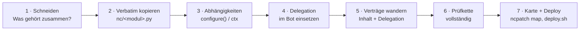
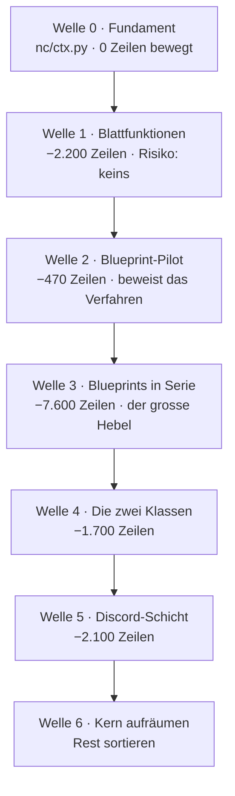

# Den Monolithen zerlegen — Plan

`bot_v37.py` hat **34.487 Zeilen / 1,63 MB**. Diese Datei ist der Engpass des
Projekts: sie lässt sich nicht lesen, nicht überblicken und nur mit Werkzeug
(`ncpatch`) bearbeiten. Dieses Dokument sagt, wie sie kleiner wird, **ohne dass
der Bot dabei stehenbleibt**.

Alle Zahlen hier sind gemessen, nicht geschätzt — reproduzierbar mit
`python3 tools/ncpatch.py map` und den Skripten aus [Anhang A](#anhang-a--die-messungen-nachfahren).

---

## Inhalt

- [1 · Der Befund](#1--der-befund)
- [2 · Warum die bisherige Zerlegung stehen geblieben ist](#2--warum-die-bisherige-zerlegung-stehen-geblieben-ist)
- [3 · Die eine Regel, die alles trägt](#3--die-eine-regel-die-alles-trägt)
- [4 · Das Verfahren je Welle](#4--das-verfahren-je-welle)
- [5 · Die Wellen](#5--die-wellen)
- [6 · Was ausdrücklich nicht gemacht wird](#6--was-ausdrücklich-nicht-gemacht-wird)
- [7 · Risiken und Gegenmittel](#7--risiken-und-gegenmittel)
- [8 · Zielbild und Messlatte](#8--zielbild-und-messlatte)
- [Anhang A · Die Messungen nachfahren](#anhang-a--die-messungen-nachfahren)

---

## 1 · Der Befund

Der Monolith sieht schlimmer aus, als er ist. Vier Messungen entscheiden das.

### 1.1 Die Masse liegt in vier Blöcken

| Block | Zeilen | Anteil | Symbole |
|---|---:|---:|---:|
| **Flask-Routen** | 8.097 | 28 % | 345 |
| **Discord-Schicht** | 2.134 | 7 % | 45 Commands + 4 Events |
| **Zwei grosse Klassen** (`RestreamManager` 979, `KickModerator` 747) | 1.726 | 6 % | 2 |
| **Global-freie Funktionen** (verstreut) | 2.189 | 8 % | 173 |
| Rest (Scraper, Recorder, Loops, Helfer) | ~15.000 | 51 % | ~500 |
| **Summe Symbolkörper** | **29.211** | | **920** |

Fast die Hälfte des Codes liegt in vier Blöcken, für die es jeweils **ein**
etabliertes Verfahren gibt. Das ist der Hebel.

### 1.2 Die Kopplung ist breit, aber flach

Der ganze Monolith hängt an zwei Namen:

| Global | gelesen von |
|---|---:|
| `dashboard_app` | **355** Funktionen |
| `log` | **240** Funktionen |
| `RECORDINGS_DIR` | 35 |
| `_KICK_MOD` | 27 |
| `_RESTREAM_MGR` | 19 |
| … 216 weitere | je < 20 |

`dashboard_app` ist nur der Flask-Dekorator — er verschwindet mit dem Umstieg
auf Blueprints von selbst. `log` ist ein Logger, also genau das, was
`configure(...)`-Injection seit 75 Wellen einspeist. **Die beiden mit Abstand
grössten Kopplungen sind die beiden billigsten.**

### 1.3 Fast alles ist Konfiguration, kein geteilter Zustand

Von 621 Zuweisungen auf Modulebene werden **nur 37 jemals per `global`
geschrieben** — und davon haben 32 genau *einen* schreibenden Eigentümer:

```
_COOKIE_REFRESH_DIRTY   → _capture_set_cookies, _persist_refreshed_cookies
_AI_SESSION             → _close_ai_session, _get_ai_session
_YTDLP_FAIL_STREAK      → _ytdlp_note_result
_whisper_model          → _whisper_get_model
…
```

Das sind **modul-lokale Caches, keine geteilte Wahrheit**. Ein Cache mit genau
einem Eigentümer wandert zusammen mit seinem Eigentümer ins Modul und hört auf,
ein Global zu sein. Übrig bleiben fünf echte Laufzeit-Singletons
(`_DISCORD_CLIENT`, `live_check_queue`, `_MAIN_LOOP`, `_GLOBAL_SCRAPER`,
`_BOT_START_TIME`) — und die gehören ohnehin in die Kompositionswurzel.

### 1.4 Die Flask-Schicht ist dünner, als 8.000 Zeilen vermuten lassen

| Messung | Wert |
|---|---|
| Fremdbezüge je Route (ohne `dashboard_app`/`log`), Median | **2** |
| Routen mit ≤ 2 Fremdbezügen | 243 von 345 (70 %) |
| Routen mit > 10 Fremdbezügen | **8** |
| Helfer, die Routen aufrufen | 203 |
| … davon von genau **einer** Route genutzt | 133 (66 %) — reisen mit ihrem Blueprint mit |
| … von 2–3 Routen | 57 |
| … **echte Querschnittshelfer** (> 3 Routen) | **13** |
| `url_for(...)` im gesamten Projekt | **0** |

Die letzte Zeile ist die wichtigste des ganzen Dokuments. Der übliche
Blueprint-Killer ist, dass die Umbenennung der Endpunkt-Namen
(`api_recordings` → `recordings.api_recordings`) jedes `url_for` bricht. Hier
gibt es kein einziges: das Dashboard ist eine JS-Oberfläche, die `/api/...` als
Zeichenkette anspricht. **Blueprints sind hier verhaltensneutral.**

---

## 2 · Warum die bisherige Zerlegung stehen geblieben ist

Das Projekt zerlegt bereits — seit 75 markierten Wellen (W4 … W103), mit
97 Delegations-Importen und 83 Modulen in `nc/`. Das Verfahren funktioniert.
Trotzdem ist der Monolith 1,63 MB gross, während `nc/` nur 461 KB umfasst.

Der Grund steht in der Grössenverteilung:

| | `nc/`-Modul |
|---|---|
| Median | **3,8 KB** |
| Mittel | 5,6 KB |
| Grösste | `schema.py` 28 KB, `freeai.py` 22 KB, `evolution.py` 18 KB |

Herausgelöst wurden bisher **Blattfunktionen**: reine Parser, Formatierer,
Kommandobauer (`ffbuild`, `ffver`, `netstat`, `convmap`, `admod`, `binresolve`).
Alle richtig, alle klein. Bei 4 KB pro Welle braucht der Monolith
**rund 400 weitere Wellen**.

> **Die Schlussfolgerung ist nicht, das Verfahren zu wechseln.** Es ist,
> dasselbe Verfahren endlich auf die *grossen* Blöcke anzuwenden — und dafür
> braucht es zwei Mechanismen, die es bisher nicht gab: einen Kontext für
> injizierte Abhängigkeiten und Flask-Blueprints.

---

## 3 · Die eine Regel, die alles trägt

**Verbatim verschieben, im Bot delegieren, den Vertrag mitwandern lassen.**

Nichts wird beim Verschieben „nebenbei verbessert". Eine Welle, die Verhalten
ändert *und* Code verschiebt, ist nicht mehr rückrollbar, weil im Fehlerfall
niemand weiss, welche der beiden Hälften schuld ist.

Der Bezugsfall ist W44 (`nc/ffbuild.py`), und der sieht so aus:

```python
# nc/ffbuild.py — der Körper, unverändert
def ff_cmd(cmd, threads=None, nice=None):
    out = list(cmd)
    if threads and threads > 0 and "-threads" not in out:
        assert out and out[0] == "ffmpeg", "_ff_cmd erwartet ffmpeg an Position 0"
        out[1:1] = ["-threads", str(int(threads))]
    ...
```

```python
# bot_v37.py — was übrig bleibt
from nc import ffbuild as _nc_ffbuild

def _ff_cmd(cmd, threads=None, nice=None):
    return _nc_ffbuild.ff_cmd(cmd, threads=threads, nice=nice)
```

### 3.1 Die Vertragswanderung — der Punkt, an dem es sonst scheitert

`test_restream.py` hat **306 Verträge in 172 Testfunktionen**, und **149 davon
verankern sich an wörtlichem Quelltext von `bot_v37.py`**:

```python
assert 'out[1:1] = ["-threads", str(int(threads))]' in src
```

Verschiebt man den Code, kippt der Vertrag — obwohl der Code stimmt. Das ist
kein Grund, den Vertrag zu löschen. **Der Vertrag wandert mit und wird dabei
zu zwei Verträgen:**

```python
# 1. Der Inhalt lebt jetzt im Modul
assert 'out[1:1] = ["-threads", str(int(threads))]' in open("nc/ffbuild.py").read(), \
    "-threads muss direkt hinter 'ffmpeg' stehen (nc.ffbuild seit W44)"

# 2. Und der Bot delegiert wirklich dorthin — keine Doppel-Logik
assert "from nc import ffbuild as _nc_ffbuild" in src, "Modul nicht importiert"
assert "return _nc_ffbuild.ff_cmd(cmd, threads=threads, nice=nice)" in src, "delegiert nicht"
```

Der zweite Teil ist der wertvollere: er verhindert genau den Zerfall, an dem
solche Umbauten sonst sterben — dass das Modul entsteht, der alte Code im
Monolithen aber „vorsichtshalber" liegen bleibt und beide auseinanderlaufen.

**Regel: Keine Welle darf einen Vertrag ersatzlos entfernen.** Entweder er
wandert, oder die Welle ist falsch geschnitten.

---

## 4 · Das Verfahren je Welle

Immer dieselben sieben Schritte. Eine Welle ist erst fertig, wenn alle sieben
durch sind.



**1 · Schneiden.** Ein Modul ist ein Thema, kein Ordner voller Reste. Kriterium:
Lässt sich in einem Satz sagen, wofür es zuständig ist? Wenn nicht, ist der
Schnitt falsch.

**2 · Verbatim kopieren.** Körper unverändert, inklusive Kommentaren und der
Asserts. Ein Modul-Docstring oben sagt, aus welcher Welle es stammt und warum
es gelöst wurde.

**3 · Abhängigkeiten auflösen.** Reihenfolge der Präferenz:

1. **Rein** — kein Zustand, keine Injection. Beste Lösung, gilt für 173 Funktionen.
2. **Argument** — die Abhängigkeit wird durchgereicht (`conn`, `log`).
3. **`configure(...)`** — für langlebige Konfiguration, wie in 19 Modulen bereits üblich.
4. **`ctx`** — nur für die 13 echten Querschnittshelfer, siehe Welle 0.

**4 · Delegation.** Der Bot behält den alten Namen und die alte Signatur und
ruft das Modul auf. Der alte Körper wird **gelöscht**, nicht auskommentiert.

**5 · Verträge wandern** (Abschnitt 3.1).

**6 · Prüfkette** — vollständig, nach `CONTRIBUTING.md`:

```bash
python3 -m py_compile <geänderte .py>
python3 -m pyflakes   <geänderte .py>        # 0 Befunde
python3 -m ruff check --select F,E9,B --ignore B905 <geänderte .py>
python3 tools/ncpatch.py check
python3 test_restream.py && python3 test_nc_modules.py && python3 test_m2_bridge.py
python3 test_smoke.py                        # nur auf dem Server, siehe unten
```

Zusätzlich, weil beim Verschieben genau das schiefgeht:

```bash
# keine doppelten Top-Level-Defs (Kopie liegen geblieben)
python3 -c "import ast,collections;b=ast.parse(open('bot_v37.py',encoding='utf-8').read()).body;\
n=[x.name for x in b if hasattr(x,'name')];d=[k for k,v in collections.Counter(n).items() if v>1];\
print('DUPLIKATE:',d) if d else print('keine doppelten Defs')"

# keine doppelte Route (Pfad + methods zusammen!)
python3 tools/ncpatch.py map && grep -oE '^\s+[0-9]+\s+\S+\s+\S+' .claude/INDEX.md | \
  awk '{print $2, $3}' | sort | uniq -d
```

**7 · Karte und Deploy.** `python3 tools/ncpatch.py map` neu bauen und
mitcommitten — der Diff auf `.claude/INDEX.md` ist die Kontrollanzeige der
Welle: er muss genau die verschobenen Symbole zeigen und **keine Route
verlieren**. Dann `bash tools/deploy.sh <zip>`, das im Nebenverzeichnis prüft
und bei Fehlschlag selbst zurückrollt.

> **`test_smoke.py` ist die einzige Abnahme, die zählt.** Es führt `bot_v37.py`
> wirklich aus und findet damit als Einziges die Fehlerklasse, die dieser Umbau
> erzeugt: NameError durch einen Namen, der nach dem Verschieben nicht mehr da
> ist, und Reihenfolge-Fallen beim Import. Es läuft nur auf dem Server.
> **Keine Welle geht ohne grünes `test_smoke.py` in Produktion.**

---

## 5 · Die Wellen



### Welle 0 — Fundament (kein Code bewegt)

Zwei Dinge anlegen, sonst nichts. Wer hier abkürzt, baut in Welle 3 vierzig
`configure()`-Parameter.

**`nc/ctx.py`** — ein Namensraum für die **13** echten Querschnittshelfer und
die fünf Laufzeit-Singletons. Der Bot füllt ihn genau einmal beim Start; `nc/`
liest nur. Kein Import aus `bot_v37` — die Architektur-Grenze bleibt.

```python
"""nc.ctx — der Laufzeitkontext, den herausgelöste Module brauchen.

Warum das existiert: die Routen-Blueprints brauchen 13 Helfer, die im
Monolithen leben (db_conn, _run_async_from_flask, _arg_int, _cfg_get/_set …).
Sie einzeln durch 20 configure()-Parameter zu reichen, erzeugt genau die
Signatur-Drift, an der die Restream-Verträge schon dreimal gekippt sind.
Ein Objekt, einmal gefüllt, ist die kleinere Angriffsfläche.

Es ist KEIN Sammelbecken. Was nur eine Route braucht, gehört ins Blueprint,
nicht hierher — die Liste ist bewusst kurz und wird in Code-Review verteidigt.
"""

class Ctx:
    __slots__ = ("log", "db_conn", "run_async", "arg_int", "cfg_get", "cfg_set",
                 "loop_not_ready", "restream_mgr", "kick_mod", "scraper",
                 "discord_client", "main_loop", "start_time")

_CTX = None

def configure(**kw):
    """Einmal beim Bot-Start gerufen. Danach nur noch lesen."""
    global _CTX
    c = Ctx()
    for k, v in kw.items():
        setattr(c, k, v)
    _CTX = c
    return c

def get():
    if _CTX is None:
        raise RuntimeError("nc.ctx nicht konfiguriert — configure() fehlt im Startpfad")
    return _CTX
```

**Ein Vertrag dazu** in `test_nc_modules.py`: `get()` ohne `configure()` muss
laut scheitern, nicht still `None` liefern. Ein stiller `None`-Kontext wäre
exakt der „stille `except`"-Fehler aus `CLAUDE.md`, nur eine Ebene höher.

**Abnahme:** Prüfkette grün, Bot startet, keine Verhaltensänderung.

---

### Welle 1 — Die 173 global-freien Funktionen

**2.189 Zeilen, Risiko praktisch null.** Diese Funktionen lesen kein einziges
Modul-Global. Sie sind per Definition rein und können heute gehen.

Nicht 173 Einzelmodule anlegen — nach Thema bündeln, so wie `nc/cfgnorm.py`
(„reine Config-Normalisierer, gebündelt") es vormacht. Grober Schnitt:

| Neues Modul | Was hinein gehört |
|---|---|
| `nc/summaries.py` | `_build_daily_summary`, `topusers`, `recstatus`-Formatierung |
| `nc/manifest.py` | `build_recording_manifest`, Archiv-Namen |
| `nc/sysread.py` | `_cpu_load_snapshot`, `_screen_full`, `_reap_proc` |
| `nc/chanstatus.py` | `_twitch_channel_status`, `_youtube_set_channel` |
| … | nach Fund |

**Warum zuerst:** Es ist die einzige Welle, die *ohne* neue Mechanik
funktioniert. Sie zahlt sofort ein, hält das Verfahren warm und liefert die
Vertragswanderung in Serie, bevor es an die grossen Blöcke geht.

**Abnahme:** −2.200 Zeilen, `.claude/INDEX.md` zeigt genau diese Symbole
verschoben, sonst nichts.

---

### Welle 2 — Blueprint-Pilot: `/api/recordings`

**Genau ein Blueprint, 26 Routen, 468 Zeilen.** Ziel ist nicht die Zeilenzahl,
sondern der Beweis, dass das Verfahren trägt.

```python
# nc/routes/recordings.py
from flask import Blueprint, jsonify, request
from nc import ctx as _ctx

bp = Blueprint("recordings", __name__)   # KEIN url_prefix:
                                          # die Pfade bleiben wörtlich stehen

@bp.route("/api/recordings")
def api_recordings():
    c = _ctx.get()
    with c.db_conn() as conn:
        ...
```

```python
# bot_v37.py, im Startpfad — eine Zeile pro Blueprint
from nc.routes import recordings as _rt_recordings
dashboard_app.register_blueprint(_rt_recordings.bp)
```

**Die drei Dinge, die geprüft werden müssen — und warum sie hier haltbar sind:**

| Gefahr | Befund |
|---|---|
| `url_for` bricht durch neue Endpunkt-Namen | **0 Vorkommen im ganzen Projekt.** Das Dashboard spricht `/api/...` als Zeichenkette an. |
| App-weite Hooks wandern versehentlich mit | Die 6 `before_request`/`after_request`/`errorhandler` bleiben **auf der App**. Ein Blueprint-Hook gilt nur für sein Blueprint — das wäre eine stille Verhaltensänderung. |
| Route verschwindet unbemerkt | `ncpatch map` vor/nach vergleichen: **318 Routen vorher, 318 nachher.** Ein Diff mit weniger Zeilen ist ein Abbruchgrund. |

**Zusätzlicher Vertrag** in `test_restream.py`: die Menge der registrierten
Regeln muss vor und nach der Welle identisch sein — Pfad **und** `methods`
zusammen, weil derselbe Pfad mit GET und POST kein Duplikat ist.

**Abnahme:** identische Routentabelle, `test_smoke.py` grün auf dem Server,
Dashboard im Browser sichtbar unverändert.

---

### Welle 3 — Blueprints in Serie

Jetzt der grosse Hebel: **rund 7.600 Zeilen** in etwa 14 Paketen. Reihenfolge
nach Grösse und Eigenständigkeit, ein Paket pro Welle:

| Blueprint | Routen | Zeilen |
|---|---:|---:|
| `nc/routes/ai.py` | 24 | 896 |
| `nc/routes/restream.py` | 16 | 434 |
| `nc/routes/archive.py` | 11 | 344 |
| `nc/routes/trackings.py` | 15 | 342 |
| `nc/routes/brain.py` | 6 | 315 |
| `nc/routes/system.py` | 7 | 306 |
| `nc/routes/ops.py` | 10 | 298 |
| `nc/routes/azrael.py` | 18 | 261 |
| `nc/routes/streamer.py` | 9 | 205 |
| `nc/routes/discord.py` | 6 | 198 |
| `nc/routes/insights.py` | 8 | 183 |
| `nc/routes/kick.py` + `kickmod` | 17 | 300 |
| `nc/routes/donations.py` | 5 | 130 |
| Rest (≈ 90 Präfixe, kleinteilig) | ~190 | ~2.500 |

Die **133 Helfer, die nur eine Route benutzt**, wandern mit in ihr Blueprint —
sie sind der eigentliche Zeilengewinn. Die 57 Helfer mit 2–3 Nutzern gehen
dorthin, wo die Mehrheit sitzt; die 13 Querschnittshelfer bleiben im Kontext.

> **Die 8 Routen mit mehr als 10 Fremdbezügen kommen zuletzt** — `api_selftest`
> (227 Zeilen), `api_brain` (211). Bei ihnen ist der Schnitt Kopfarbeit, nicht
> Mechanik. Sie dürfen bis Welle 6 im Monolithen liegen bleiben, ohne dass der
> Rest darauf wartet.

**Kein Big-Bang.** Nach jedem Paket ist der Bot lauffähig, ausgeliefert und
beobachtet. Wer alle 14 in einer Welle macht, kann bei einem Fehler nicht mehr
sagen, welches Paket ihn erzeugt hat.

---

### Welle 4 — Die zwei grossen Klassen

`RestreamManager` (979 Zeilen) und `KickModerator` (747). Eine Klasse ist
bereits gekapselt — der Umzug ist fast reines Verschieben. Was aufzulösen ist:
die Modul-Globals, die sie lesen. Die werden zu Konstruktor-Argumenten.

```python
# nc/restream_manager.py
class RestreamManager:
    def __init__(self, *, log, db_conn, recordings_dir, ff_cmd, targets, guard):
        ...
```

**Der Stolperstein, der hier schon dreimal zugeschlagen hat:** die
Restream-Verträge verankern sich an Signaturen wie `stop(self, rid)` — genau
diese Klasse. Vor jeder Anpassung prüfen, ob der **Vertrag** oder nur sein
**Anker** gebrochen ist. Und die Iterationen über `_RESTREAM_ACTIVE_ALL`
brauchen weiterhin `list()`, sonst kehrt die Race Condition aus 4.0 zurück.

---

### Welle 5 — Die Discord-Schicht

**2.134 Zeilen**, davon `_discord_run_once` allein **1.682**. Ein neues Paket
`discord_ext/` mit einer `setup(bot, ctx)`-Registrierung pro Themengruppe
(Moderation, Community, Clips, Server-Aufbau, `sys_*`).

Zwei Dinge bleiben, wie sie sind:

- **Der Shim bleibt.** Die 15 `/sys_*`-Kommandos führen die
  Original-Telegram-Handler aus. Das ist kein Altlast-Kompromiss, sondern der
  Grund, warum es keine Duplikate gibt — er wird mitverschoben, nicht ersetzt.
- **Der Supervisor bleibt.** `_discord_run_once` ist der Reconnect-Loop mit
  Backoff. Er gehört in die Kompositionswurzel, nicht ins Paket. Ein
  Long-Running-Client ohne Supervisor ist genau der Fehler, der den
  Gateway-Tod monatelang unsichtbar gemacht hat.

Nach der Welle: Slash-Commands gegen echtes `discord.py` rekonstruieren
(Namen `^[-_a-z0-9]{1,32}$`, Description ≤ 100 Zeichen, Signatur/`describe`-Match)
— steht so in der Skill-Anweisung und ist hier Pflicht, weil die Registrierung
umzieht.

---

### Welle 6 — Kern aufräumen

Was übrig ist, sortieren: Scraper, Recorder, die Dauerschleifen. Kein Zwang,
alles zu bewegen. `bot_v37.py` soll am Ende **Kompositionswurzel** sein:
`.env` lesen, Kontext füllen, Blueprints registrieren, Loops starten,
Supervisor fahren.

---

## 6 · Was ausdrücklich nicht gemacht wird

| Nicht tun | Warum |
|---|---|
| **Grosser Wurf in einem Zug** | Deploy geht gegen Produktion. Eine Welle, die nicht einzeln rückrollbar ist, ist nicht ausrollbar. |
| **Beim Verschieben verbessern** | Verhalten und Ort gleichzeitig ändern macht jeden Fehler unauflösbar. Verbesserung ist eine eigene Welle danach. |
| **`nc/` aus `bot_v37` importieren lassen** | Bricht die Architektur-Grenze und erzeugt Zirkularimporte im grössten File des Projekts. |
| **Verträge löschen, weil sie kippen** | Ein gekippter Anker ist eine Wanderung, kein Freibrief. Sonst ist der Umbau nach zehn Wellen ungetestet. |
| **`async` → `sync` oder Framework-Wechsel** | Kein Zerlegungsproblem. Getrennt entscheiden, wenn überhaupt. |
| **`brain/` anfassen** | Ist bereits sauber getrennt, stdlib-only, mit eigener DB. Es ist das Vorbild, nicht die Baustelle. |
| **Auf 0 Zeilen im Monolithen zielen** | Eine Kompositionswurzel von 6–8k Zeilen ist ein gutes Ergebnis. Der Rest wäre Symbolik. |

---

## 7 · Risiken und Gegenmittel

| Risiko | Was passiert | Gegenmittel |
|---|---|---|
| **Doppelte Definition** | Alter Körper bleibt liegen, beide laufen auseinander | Delegations-Vertrag (3.1) + `ast`-Duplikatprüfung in Schritt 6 |
| **Route verschwindet** | Panel im Dashboard bleibt leer, niemand merkt es | Routenzahl vor/nach vergleichen, `ncpatch map`-Diff ist Pflichtbeleg |
| **NameError nach dem Verschieben** | Bot startet nicht mehr | `test_smoke.py` auf dem Server — die einzige Abnahme, die den Bot wirklich ausführt |
| **Blueprint-Hook statt App-Hook** | `after_request` gilt plötzlich nur noch für ein Blueprint | Die 6 Hooks bleiben nachweislich auf der App; Vertrag darauf |
| **Import-Reihenfolge** | `.env` wird nach dem Modul-Import gelesen, Konfiguration friert ein | Konfiguration als **Funktion** lesen, nie als Modul-Konstante (`CLAUDE.md`) |
| **Kontext wird zum Sammelbecken** | `nc/ctx.py` hat nach 10 Wellen 60 Felder, alles hängt an allem | `__slots__` + die Regel: was eine Route braucht, gehört ins Blueprint |
| **Vertragsanker kippt reihenweise** | Tests rot, obwohl der Code stimmt | Erst Anker prüfen, dann Code — nie umgekehrt |
| **Welle wird zu gross** | Fehler nicht mehr zuzuordnen | Ein Blueprint bzw. ein Thema je Welle, Zwischenstand melden |

---

## 8 · Zielbild und Messlatte

| | heute | nach Welle 3 | Ziel |
|---|---:|---:|---:|
| `bot_v37.py` Zeilen | 34.487 | ~24.700 | **~8.000** |
| `bot_v37.py` Grösse | 1,63 MB | ~1,15 MB | **~0,4 MB** |
| Flask-Routen im Monolithen | 345 | ~30 | 0 |
| `nc/`-Module | 83 | ~100 | ~115 |
| Grösste Datei im Projekt | `bot_v37.py` | `bot_v37.py` | `templates/dashboard.html` |

Die härtere Messlatte ist keine Zahl:

> **Eine neue API-Route anzulegen, ohne `bot_v37.py` zu öffnen.**

Solange das nicht geht, ist der Umbau nicht fertig — egal, wie viele Zeilen
gewandert sind.

### Wann sich das gelohnt hat

Nach Welle 3. Bis dahin ist es Arbeit ohne spürbaren Gewinn; danach ist die
Flask-Schicht — der Teil, an dem am häufigsten geändert wird — vollständig
ausserhalb des Monolithen, mit 318 Routen in überschaubaren Dateien. Die
Wellen 4 bis 6 sind Aufräumen, kein Engpass mehr.

**Ehrlich zum Aufwand:** Bei der Arbeitsweise des Projekts (eine Welle
liefern, validieren, beobachten, dann die nächste) sind das etwa **20 bis 25
Wellen**. Wer nach Welle 3 aufhört, hat den Grossteil des Nutzens und einen
Monolithen, der wieder handhabbar ist.

---

## Anhang A · Die Messungen nachfahren

Alle Zahlen dieses Dokuments stammen aus diesen zwei Läufen.

**Blöcke, Globals, Kopplung:**

```bash
python3 - <<'PY'
import ast, io
from collections import defaultdict
src = io.open('bot_v37.py', encoding='utf-8').read()
tree = ast.parse(src)
gl = {t.id for n in tree.body if isinstance(n, (ast.Assign, ast.AnnAssign))
      for t in (n.targets if isinstance(n, ast.Assign) else [n.target])
      if isinstance(t, ast.Name)}
users = defaultdict(set); pure = 0; pure_lines = 0
for n in tree.body:
    if not isinstance(n, (ast.FunctionDef, ast.AsyncFunctionDef)):
        continue
    start = min([d.lineno for d in n.decorator_list] + [n.lineno])
    local = {a.arg for a in n.args.args + n.args.kwonlyargs}
    reads = set()
    for x in ast.walk(n):
        if isinstance(x, ast.Name):
            if isinstance(x.ctx, ast.Store): local.add(x.id)
            elif x.id in gl and x.id not in local: reads.add(x.id)
        if isinstance(x, ast.Global): reads.update(x.names)
    for g in reads: users[g].add(n.name)
    if not reads: pure += 1; pure_lines += n.end_lineno - start + 1
print(f"Zeilen {src.count(chr(10)):,} · Globals {len(gl)} · global-frei {pure} ({pure_lines:,} Zeilen)")
for g, u in sorted(users.items(), key=lambda x: -len(x[1]))[:5]:
    print(f"  {g:<24} gelesen von {len(u)}")
PY
```

**Routen, Fremdbezüge, Helfer-Streuung:**

```bash
python3 - <<'PY'
import ast, io, statistics
from collections import Counter
src = io.open('bot_v37.py', encoding='utf-8').read()
tree = ast.parse(src)
top = {n.name for n in tree.body if hasattr(n, 'name')}
gl = {t.id for n in tree.body if isinstance(n, (ast.Assign, ast.AnnAssign))
      for t in (n.targets if isinstance(n, ast.Assign) else [n.target])
      if isinstance(t, ast.Name)}
routes = [n for n in tree.body if isinstance(n, (ast.FunctionDef, ast.AsyncFunctionDef))
          and any('route(' in ast.unparse(d) for d in n.decorator_list)]
per = []; helpers = Counter()
for n in routes:
    local = {a.arg for a in n.args.args}
    for x in ast.walk(n):
        if isinstance(x, ast.Name) and isinstance(x.ctx, ast.Store): local.add(x.id)
    calls = set(); refs = set()
    for x in ast.walk(n):
        if isinstance(x, ast.Call) and isinstance(x.func, ast.Name) and x.func.id in top:
            calls.add(x.func.id)
        if isinstance(x, ast.Name) and isinstance(x.ctx, ast.Load) and x.id in gl \
           and x.id not in local and x.id not in ('dashboard_app', 'log'):
            refs.add(x.id)
    per.append(len(calls | refs))
    for h in calls:
        helpers[h] += 1          # einmal je ROUTE zaehlen, nicht je Aufrufstelle
print(f"Routen {len(routes)} - Median Fremdbezuege {statistics.median(per):.0f}"
      f" - <=2: {sum(1 for p in per if p <= 2)} - >10: {sum(1 for p in per if p > 10)}")
print(f"Helfer {len(helpers)} - nur 1 Route: {sum(1 for v in helpers.values() if v == 1)}"
      f" - 2-3 Routen: {sum(1 for v in helpers.values() if 2 <= v <= 3)}"
      f" - >3 Routen: {sum(1 for v in helpers.values() if v > 3)}")
print("url_for im Projekt:", src.count('url_for'))
PY
```

Erwartete Ausgabe (Stand v4.0):

```
Routen 345 - Median Fremdbezuege 2 - <=2: 243 - >10: 8
Helfer 203 - nur 1 Route: 133 - 2-3 Routen: 57 - >3 Routen: 13
url_for im Projekt: 0
```

---

*Erstellt für NIGHTCRAWLER v4.0. Wird mit jeder abgeschlossenen Welle
fortgeschrieben — die Tabelle in [Abschnitt 8](#8--zielbild-und-messlatte) ist
der Fortschrittsbalken.*
